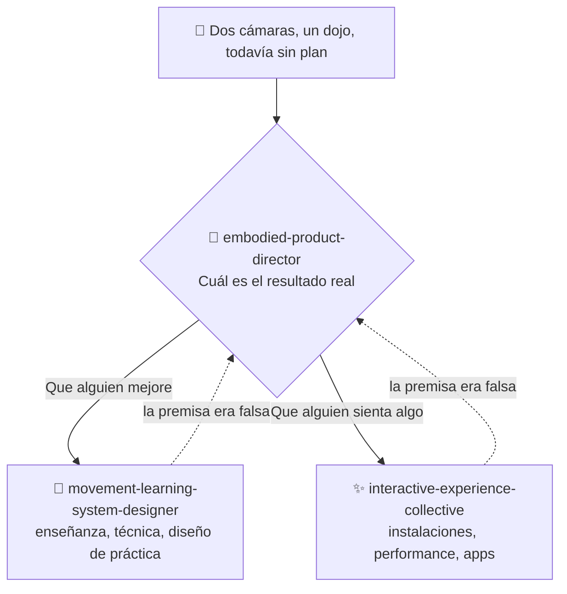

# ⚡ interactive-experience-skills

[](https://opensource.org/licenses/MIT)
[](https://claude.com/claude-code)


[English](README.md) · [日本語](README.ja.md) · [简体中文](README.zh-CN.md) · **Español** · [한국어](README.ko.md)

> **Decide si estás haciendo una obra o un producto, antes de elegir una sola cámara, un sensor o un framework.**

> **Aviso:** el contenido de los tres skills está escrito en japonés. Claude los lee y los aplica en cualquier idioma, pero si abres los archivos vas a encontrarte con japonés. Este README existe para que puedas decidir si te sirven antes de instalarlos.

---

## 🔰 ¿Qué es esto?

*Para no técnicos:* imagina que tienes dos cámaras y la intuición de que se puede construir algo interesante con ellas. El consejo habitual salta directo a qué software usar. Un buen director hace lo contrario: primero pregunta para quién es, qué mejora de verdad y quién paga. Recién después habla de equipo.

Son tres skills de Claude Code que hacen que Claude se comporte como ese director en proyectos que involucran cuerpo, movimiento, cámaras y espacio.

---

## 📐 Arquitectura



Un pedido que ya tiene claro su dominio y su entregable se saltea el director y activa el skill especializado directamente. El director es una entrada para proyectos sin rumbo definido, no un peaje obligatorio.

---

## ✨ 3 puntos clave

### 🧭 Enruta por resultado, no por palabras clave
«Danza» puede significar aprendizaje de coreografía, arte digital, una herramienta de creación, fitness o rehabilitación. La pregunta que decide es siempre la misma: **¿el resultado es mejorar o es sentir algo?** Y no se queda en «depende»: elige una y explica por qué.

### 📐 Responde con números que puedes usar
5.000–8.000 lúmenes para una proyección de 3 m en una sala oscura. Un presupuesto de latencia de 100 ms para retroalimentación corporal. Qué ángulo de cámara puede medir la distancia de un paso y cuál no. El cálculo del punto de equilibrio de una experiencia de pago. Unos 96.000 caracteres de material de referencia, que se cargan solo cuando el modo lo necesita.

### 🚫 Sabe dónde detenerse
No evalúa dolor, lesiones ni rango de movimiento. Prefiere el silencio a adivinar cuando la confianza es baja, porque un solo error evidente basta para que un experto descarte el sistema entero. Cuando se filma a menores, el consentimiento de los tutores va antes que la tecnología. Y nunca confunde precisión de seguimiento con aprendizaje.

---

## 🔄 Antes / Después

| | Antes | Después |
|---|---|---|
| Punto de partida | «Tenemos dos cámaras, ¿qué podemos hacer?» | «¿En qué problema una segunda cámara justifica su costo?» |
| ¿Obra o producto? | Se discute indefinidamente | Se resuelve con una pregunta, y con el motivo explícito |
| Respuesta técnica | «Inmersivo, con IA, futurista» | 5.000–8.000 lm · 100 ms · con una cámara alcanza |
| Presupuesto individual | Se trata como una versión recortada | Se trata como la forma final y quizá la mejor |
| Estimación de pose | «Más precisión significa que se aprende mejor» | Precisión y aprendizaje no se relacionan; diseña para el aprendizaje |

---

## 🚀 Instalación y uso

Necesitas [Claude Code](https://claude.com/claude-code), `git`, `bash` y `zip`. El instalador es un script de bash, así que usa macOS, Linux o WSL.

### 🖥️ Claude Code (CLI)

```bash
git clone https://github.com/takaoumehara/interactive-experience-skills.git
cd interactive-experience-skills
./install.sh
```

Deberías ver cuatro líneas de confirmación (el instalador imprime en japonés): una por skill, más el comando `/motion-idea`. El instalador verifica que cada archivo de referencia declarado por un skill exista de verdad, y aborta sin copiar nada si falta alguno.

Se instala en:

```
~/.claude/skills/embodied-product-director/
~/.claude/skills/interactive-experience-collective/
~/.claude/skills/movement-learning-system-designer/
~/.claude/commands/motion-idea.md
```

Abre una sesión nueva de Claude Code y usa el comando:

```
/motion-idea Tengo dos cámaras y quiero hacer algo con la práctica de artes marciales
```

…o simplemente describe tu proyecto en lenguaje natural: los skills especializados se activan solos.

```
Diseña una proyección que reaccione al movimiento de un bailarín
```

### 🌐 claude.ai (navegador)

El repositorio incluye cada skill empaquetado. Son archivos zip comunes:

```bash
cp embodied-product-director.skill embodied-product-director.zip
```

Sube el `.zip` desde la configuración de skills de tu asistente — consulta la [documentación de Claude](https://docs.claude.com/en/docs/agents-and-tools/agent-skills/overview) para el procedimiento actual.

### 🛠️ Desde el código fuente

La fuente que se edita es `_extracted/`, no los archivos `.skill`:

```
_extracted/<skill>/SKILL.md
_extracted/<skill>/references/*.md
_extracted/<skill>/evals/evals.json
```

`SKILL.md` se carga en cada activación; `references/*.md` solo cuando el modo lo pide; `evals/evals.json` contiene las pruebas de activación.

Después de editar, ejecuta `./install.sh` otra vez: reinstala en `~/.claude/` y reconstruye los `.skill` de forma idempotente.

Para instalarlo a mano, copia los tres directorios que están dentro de `_extracted/` a `~/.claude/skills/`.

---

## 📄 Licencia

MIT — ver [LICENSE](LICENSE).

El autor también toma consultoría en este dominio: diseño de experiencias corporales, de movimiento, de cámara y espaciales; selección de tecnología; y validación del caso de negocio. Abre un issue para contactarlo.
