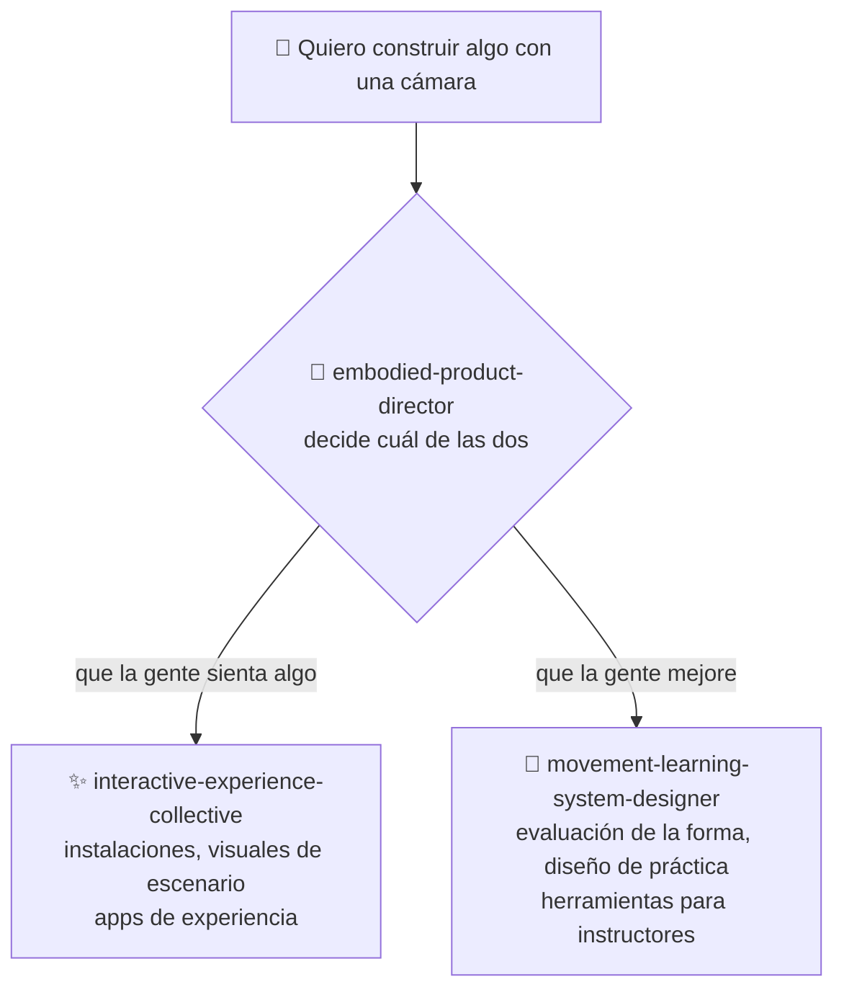

# ⚡ interactive-experience-skills

[](https://opensource.org/licenses/MIT)
[](https://claude.com/claude-code)


[English](README.md) · [日本語](README.ja.md) · [简体中文](README.zh-CN.md) · **Español** · [한국어](README.ko.md)

> **Construye algo que la gente experimenta, o una herramienta que ayuda a la gente a mejorar un movimiento, usando cámaras y sensores. Estos skills de Claude Code te ayudan a diseñarlo, empezando por decidir cuál de las dos cosas estás haciendo.**

> **Aviso:** el contenido de los tres skills está escrito en japonés. Claude los lee y los aplica en cualquier idioma, así que puedes trabajar enteramente en español. Si abres los archivos, vas a encontrarte con japonés.

---

## 🔰 ¿Qué es esto?

Usa estos skills cuando quieras construir algo que lea el movimiento de una persona con una cámara o un sensor. Lo que puedes construir se divide en dos tipos.

**① Algo que la gente experimenta**
Ese tipo de instalación que ves en un museo o en un evento, donde el video y el sonido reaccionan a cómo se mueve la gente. Projection mapping, instalaciones, visuales de escenario, apps de experiencia. **El objetivo es que quien llega sienta algo.**

**② Una herramienta para que la gente mejore**
Para disciplinas donde la forma importa —danza, artes marciales, deporte, yoga— una herramienta que te graba, evalúa lo que hiciste, te dice qué corregir y organiza tu práctica. **El objetivo es que la persona realmente mejore.**

Estas dos cosas necesitan tecnología distinta, usuarios distintos, alguien distinto que pague y una definición distinta de éxito. Y sin embargo, el error más común en este campo es empezar a discutir TouchDesigner contra Unreal, o la precisión de la estimación de pose, *antes* de decidir cuál de las dos estás haciendo. **Estos skills empiezan justamente por ahí.**

### Qué obtienes en concreto

Así se ve un intercambio real.

> **Tú:** «Tengo dos cámaras web sin usar. Quiero hacer algo con la práctica de artes marciales, pero no tengo dirección.»
>
> **El skill:** primero decide si esto es una obra o una herramienta de entrenamiento. Si es una herramienta → quién la usa (¿el alumno o el maestro?), quién paga (¿el alumno o quien administra el dojo?) y qué está fallando hoy de verdad (¿el maestro no alcanza a ver a todos? ¿los alumnos olvidan la corrección entre clases?). Después se compromete: «Todavía no necesitas la segunda cámara. Empieza con una cámara, una sola técnica, y revisada después de la práctica en lugar de en vivo» — con el razonamiento.

**No escribe código.** Lo que vuelve es una decisión de diseño: qué construir, qué equipo y cuánto, qué validar primero y qué *no* construir todavía. La implementación viene después, como un encargo normal de Claude Code.

---

## 📐 Arquitectura



Los dos skills de abajo hacen el diseño de verdad. El director de arriba solo decide hacia dónde vas.

**Si ya sabes qué estás construyendo, el director nunca aparece.** Escribe «diseña el MVP de una app de comparación de forma para un dojo» y el skill 🥋 arranca directamente. El director sirve solo cuando todavía no lo decidiste.

---

## ✨ 3 puntos clave

### 🧭 Siempre se compromete con una de las dos
«Quiero hacer una app de danza» puede significar una herramienta para memorizar coreografía o una pieza que la gente mira por placer, y son productos distintos. Este skill no termina con «bueno, podría ser cualquiera de las dos». Elige una y te dice por qué. No elegir es lo que sale más caro.

### 📐 Responde con números, no con «inmersivo» y «con IA»
5.000–8.000 lúmenes para proyectar 3 m de ancho en una sala oscura. La retroalimentación sobre un movimiento corporal tiene que volver en menos de 100 ms o deja de sentirse como *tu* movimiento. Una cámara frontal no puede medir qué tan profundo es un paso, así que hace falta una vista lateral. Para un espacio de pago, precio × rotación × días de operación decide si el negocio existe. Unos 96.000 caracteres de esto, que se cargan solo cuando la pregunta actual los necesita.

### 🚫 Dice que no con claridad
No evalúa dolor ni lesiones: eso es medicina. Cuando no tiene confianza, dice «esta no la puedo evaluar» en lugar de producir algo verosímil, porque una sola corrección claramente equivocada hace que una persona con experiencia abandone el sistema para siempre. En proyectos con menores, plantea el consentimiento de los tutores antes de hablar de tecnología. Y rechaza de plano la idea de que **más precisión en la estimación de pose hace que la gente aprenda mejor.**

---

## 🔄 Antes / Después

| | Antes | Después |
|---|---|---|
| Cómo arranca la conversación | «Tenemos dos cámaras, ¿qué podemos hacer?» | «¿En qué problema una segunda cámara vale lo que cuesta?» |
| ¿Obra o herramienta? | Nunca se resuelve; la implementación arranca igual | Se resuelve primero, con el motivo |
| La respuesta técnica | «Una experiencia inmersiva con IA» | 5.000–8.000 lm · 100 ms · con una cámara alcanza |
| Trabajar en solitario | Se trata como una versión recortada de lo real | Se trata como la forma final y quizá la mejor |
| Estimación de pose | «Más precisión, más aprendizaje» | No se relacionan; hay que rediseñar para el aprendizaje |

---

## 🚀 Instalación y uso

Necesitas [Claude Code](https://claude.com/claude-code), `git`, `bash` y `zip`. El instalador es un script de bash, así que ejecútalo en macOS, Linux o WSL.

### 🖥️ Claude Code (CLI)

```bash
git clone https://github.com/takaoumehara/interactive-experience-skills.git
cd interactive-experience-skills
./install.sh
```

Deberías ver cinco líneas de confirmación (el instalador imprime en japonés): tres skills y dos comandos. Antes de copiar nada, el instalador verifica que exista de verdad cada archivo que un skill declara que va a leer, y aborta si falta alguno.

Se instala en:

```
~/.claude/skills/embodied-product-director/
~/.claude/skills/interactive-experience-collective/
~/.claude/skills/movement-learning-system-designer/
~/.claude/commands/motion-idea.md
~/.claude/commands/refresh-skills.md
```

Abre una sesión nueva. Si todavía no tienes dirección, usa el comando:

```
/motion-idea Tengo dos cámaras web sin usar y quiero hacer algo con la práctica de artes marciales
```

Si ya sabes qué vas a construir, escríbelo normalmente: el skill correcto arranca solo.

```
Diseña una proyección que reaccione al movimiento de un bailarín
```

```
Diseña el MVP de una app que compare un golpe de karate con el del instructor
```

### 🌐 claude.ai (navegador)

Cada skill viene empaquetado como archivo `.skill`. Es un zip común, así que basta con renombrarlo para poder subirlo.

```bash
cp movement-learning-system-designer.skill movement-learning-system-designer.zip
```

Sube el `.zip` desde la configuración de skills de tu asistente — consulta la [documentación de Claude](https://docs.claude.com/en/docs/agents-and-tools/agent-skills/overview) para el procedimiento actual.

> Abrir un archivo `.skill` en GitHub no muestra nada. No está roto: GitHub simplemente no reconoce la extensión y no puede previsualizarlo. Descárgalo y ejecuta `unzip -l` para ver el contenido.

### 🛠️ Desde el código fuente

La fuente que se edita es `_extracted/`, no los archivos `.skill`.

```
_extracted/<skill>/SKILL.md
_extracted/<skill>/references/*.md
_extracted/<skill>/evals/evals.json
```

`SKILL.md` se carga en cada activación; `references/*.md` solo cuando el modo actual lo necesita; `evals/evals.json` prueba que el skill arranque cuando debe.

Después de editar, ejecuta `./install.sh` otra vez: reinstala en `~/.claude/` y reconstruye los `.skill` de forma idempotente.

Para instalarlo a mano, copia los tres directorios que están dentro de `_extracted/` a `~/.claude/skills/`.

---

## 🔁 Mantener los skills al día

Estos skills contienen nombres de productos, rangos de precio, nombres de librerías y números de hardware. **Todo eso va a quedar viejo.** Hay dos capas de defensa.

### ① Verificado en el momento de usarlo (automático, sin configurar nada)

Los pasajes de referencia que pueden caducar llevan esta marca:

```markdown
<!-- volatile: 2026-07 -->
```

Cuando el skill lee un pasaje marcado, **busca en la web para confirmar el estado actual antes de responder.** No tienes que hacer nada.

### ② Actualizado por lote (manual, aproximadamente una vez al mes)

```
/refresh-skills
```

Reúne todas las afirmaciones marcadas, las verifica en la web y lista **solo lo que cambió**. No edita nada: tú revisas y decides.

```
/refresh-skills apply
```

Aplica lo que quedó confirmado, actualiza las fechas de las marcas y ejecuta `install.sh`. Solo se aplican los hallazgos que tienen una fuente.

Para ejecutarlo periódicamente, usa el loop de Claude Code:

```
/loop 30d /refresh-skills
```

---

## 🧭 La postura de estos skills

- **Precisión de seguimiento y aprendizaje son cosas distintas.** Una estimación de pose exacta no garantiza ninguna mejora
- **«Correcto» es la opinión de alguien.** Una forma de referencia no es verdad neutral: congela el criterio de un instructor como autoridad. Hay que citar la fuente y dejar que el instructor la sobrescriba
- **Callarse cuando no hay certeza es una función, no un defecto**
- **No evalúa dolor, lesiones ni rango de movimiento.** No entra en rehabilitación sin un profesional clínico involucrado
- **Cuando se filma a menores, el consentimiento de los tutores y la política de retención van antes que la tecnología**
- **Un presupuesto ajustado debe recortar complejidad de producción innecesaria, nunca la ambición creativa**

---

## 🛠️ Desarrollo

`SKILL.md` guarda los criterios de decisión; a `references/` solo se mueven los *procedimientos* que se usan en un modo específico. Empujar los criterios a las referencias produce exactamente el fallo que estos skills existen para evitar: responder con generalidades sin haber leído nada.

Deliberadamente no están divididos en más sub-skills. Cuantas más descripciones viven de forma permanente en el system prompt, peor sale la decisión más difícil de este dominio: experiencia o mejora. La precisión de enrutamiento medida para el esquema de tres skills es del 97%, con un 11% de casos ambiguos.

`_extracted/<skill>/evals/evals.json` contiene consultas que deberían arrancar cada skill y consultas que no deberían. La mayoría de las de «no deberían» no son consultas irrelevantes: son **casos límite que pertenecen al skill hermano.** Vuelve a verificar con este conjunto después de editar cualquier descripción.

---

## 🔄 Mantenerse al día

En experiencias interactivas, la capa de los hechos cambia rápido: sensores descontinuados, GPUs que duplican su precio, una actualización del sistema que rompe silenciosamente una API de body tracking, una fecha de aplicación normativa que se mueve. **Una skill que responde con confianza usando precios del año pasado es peor que una que no responde.**

Cuatro mecanismos, cada uno con una sola función: `<!-- volatile: YYYY-MM -->` al inicio de una referencia es el **índice** (señala qué tipo de afirmaciones caducan en ese archivo); `references/current.md` es el **almacén de respuestas** (cómo está la situación hoy, con fecha, fuentes y nivel de confianza); `/refresh-skills` es la **comprobación puntual** (informa solo de lo que cambió); y `maintenance/UPDATE-ROUTINE.md` es la **rutina mensual** (comprueba, registra, deja historial y abre un PR).

Al responder: afirmación marcada → consultar `current.md` → si falta o tiene más de seis meses, buscar en la web → si no, indicar la fecha del snapshot. `CHANGELOG.md` registra qué cambió, **qué se decidió no cambiar** y **qué no se investigó en absoluto**.

---

## 📄 Licencia

MIT — ver [LICENSE](LICENSE).

El autor también toma consultoría en este dominio: diseño de experiencias corporales, de movimiento, de cámara y espaciales; selección de tecnología; y validación del caso de negocio. Abre un issue para contactarlo.
