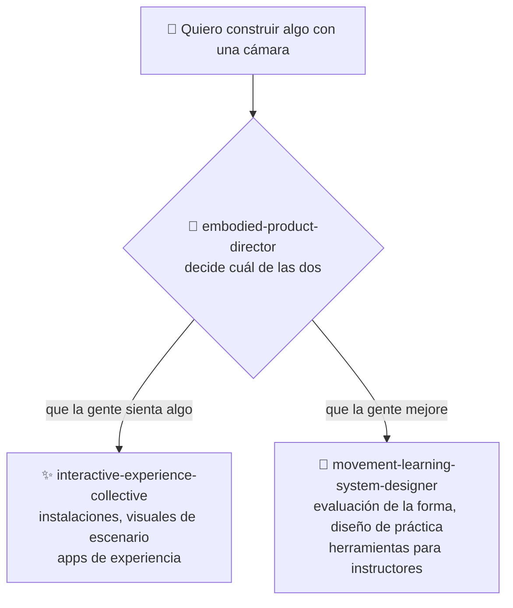

# ⚡ interactive-experience-skills

[](https://opensource.org/licenses/MIT)
[](https://claude.com/claude-code)

-DE3F24)

[English](README.md) · [日本語](README.ja.md) · [简体中文](README.zh-CN.md) · **Español** · [한국어](README.ko.md)

> **Construye algo que la gente experimenta, o una herramienta que ayuda a la gente a mejorar un movimiento, usando cámaras y sensores. Estos skills de Claude Code te ayudan a diseñarlo, empezando por decidir cuál de las dos cosas estás haciendo.**

> **Sobre el idioma:** las instrucciones de los skills (`SKILL.md`) están en inglés; la biblioteca de referencia (`references/*.md`) sigue en japonés (traducción en curso). Claude lee y aplica ambas en cualquier idioma, así que puedes trabajar enteramente en español. La descripción de cada skill conserva sus frases de activación en japonés, así que también se activa con peticiones en japonés. Los `SKILL.md` originales en japonés están en [`i18n/ja/skills/`](i18n/ja/skills/).

---

## 🔰 ¿Qué es esto?

Usa estos skills cuando quieras construir algo que lea el movimiento de una persona con una cámara o un sensor. Lo que puedes construir se divide en dos tipos.

**① Algo que la gente experimenta**
Ese tipo de instalación que ves en un museo o en un evento, donde el video y el sonido reaccionan a cómo se mueve la gente. Projection mapping, instalaciones, visuales de escenario, apps de experiencia. **El objetivo es que quien llega sienta algo.**

**② Una herramienta para que la gente mejore**
Para disciplinas donde la forma importa —danza, artes marciales, deporte, yoga— una herramienta que te graba, evalúa lo que hiciste, te dice qué corregir y organiza tu práctica. **El objetivo es que la persona realmente mejore.**

Estas dos cosas necesitan tecnología distinta, usuarios distintos, alguien distinto que pague y una definición distinta de éxito. Y sin embargo, el error más común en este campo es empezar a discutir TouchDesigner contra Unreal, o la precisión de la estimación de pose, *antes* de decidir cuál de las dos estás haciendo. **Estos skills empiezan justamente por ahí.**

### Qué obtienes en concreto

Así se ve un intercambio real.

> **Tú:** «Tengo dos cámaras web sin usar. Quiero hacer algo con la práctica de artes marciales, pero no tengo dirección.»
>
> **El skill:** primero decide si esto es una obra o una herramienta de entrenamiento. Si es una herramienta → quién la usa (¿el alumno o el maestro?), quién paga (¿el alumno o quien administra el dojo?) y qué está fallando hoy de verdad (¿el maestro no alcanza a ver a todos? ¿los alumnos olvidan la corrección entre clases?). Después se compromete: «Todavía no necesitas la segunda cámara. Empieza con una cámara, una sola técnica, y revisada después de la práctica en lugar de en vivo» — con el razonamiento.

**No escribe código.** Lo que vuelve es una decisión de diseño: qué construir, qué equipo y cuánto, qué validar primero y qué *no* construir todavía. La implementación viene después, como un encargo normal de Claude Code.

---

## 📐 Arquitectura


```mermaid
flowchart TD
    Q["👤 Quiero construir algo con una cámara"] --> D{"🧭 embodied-product-director<br/>decide cuál de las dos"}
    D -->|"que la gente sienta algo"| E["✨ interactive-experience-collective<br/>instalaciones, visuales de escenario<br/>apps de experiencia"]
    D -->|"que la gente mejore"| L["🥋 movement-learning-system-designer<br/>evaluación de la forma, diseño de práctica<br/>herramientas para instructores"]
```

Los dos skills de abajo hacen el diseño de verdad. El director de arriba solo decide hacia dónde vas.

**Si ya sabes qué estás construyendo, el director nunca aparece.** Escribe «diseña el MVP de una app de comparación de forma para un dojo» y el skill 🥋 arranca directamente. El director sirve solo cuando todavía no lo decidiste.

---

## ✨ 3 puntos clave

### 🧭 Siempre se compromete con una de las dos
«Quiero hacer una app de danza» puede significar una herramienta para memorizar coreografía o una pieza que la gente mira por placer, y son productos distintos. Este skill no termina con «bueno, podría ser cualquiera de las dos». Elige una y te dice por qué. No elegir es lo que sale más caro.

### 📐 Responde con números, no con «inmersivo» y «con IA»
5.000–8.000 lúmenes para proyectar 3 m de ancho en una sala oscura. La retroalimentación sobre un movimiento corporal tiene que volver en menos de 100 ms o deja de sentirse como *tu* movimiento. Una cámara frontal no puede medir qué tan profundo es un paso, así que hace falta una vista lateral. Para un espacio de pago, precio × rotación × días de operación decide si el negocio existe. Unos 107.000 caracteres de esto en 18 archivos de referencia (medido con `wc -m` sobre `skills/*/references/*.md`, 2026-10-04), que se cargan solo cuando la pregunta actual los necesita.

### 🚫 Dice que no con claridad
No evalúa dolor ni lesiones: eso es medicina. Cuando no tiene confianza, dice «esta no la puedo evaluar» en lugar de producir algo verosímil, porque una sola corrección claramente equivocada hace que una persona con experiencia abandone el sistema para siempre. En proyectos con menores, plantea el consentimiento de los tutores antes de hablar de tecnología. Y rechaza de plano la idea de que **más precisión en la estimación de pose hace que la gente aprenda mejor.**

---

## 🔄 Antes / Después

| | Antes | Después |
|---|---|---|
| Cómo arranca la conversación | «Tenemos dos cámaras, ¿qué podemos hacer?» | «¿En qué problema una segunda cámara vale lo que cuesta?» |
| ¿Obra o herramienta? | Nunca se resuelve; la implementación arranca igual | Se resuelve primero, con el motivo |
| La respuesta técnica | «Una experiencia inmersiva con IA» | 5.000–8.000 lm · 100 ms · con una cámara alcanza |
| Trabajar en solitario | Se trata como una versión recortada de lo real | Se trata como la forma final y quizá la mejor |
| Estimación de pose | «Más precisión, más aprendizaje» | No se relacionan; hay que rediseñar para el aprendizaje |

---

## 🚀 Instalación y uso

### 🖥️ Claude Code (recomendado: marketplace de plugins)

En Claude Code, ejecuta:

```
/plugin marketplace add takaoumehara/interactive-experience-skills
/plugin install interactive-experience-skills@interactive-experience
```

Así se instalan los tres skills como un solo plugin:

```
embodied-product-director
interactive-experience-collective
movement-learning-system-designer
```

Abre una sesión nueva. Escribe con normalidad lo que vas a construir: el skill adecuado arranca solo.

```
Diseña una pieza de projection mapping que reaccione a una bailarina
```

```
Diseña el MVP de una app que compare un puñetazo de karate con el del instructor
```

Si todavía no tienes dirección, dilo; el director se encarga:

```
Tengo dos cámaras web sin usar y quiero hacer algo con la práctica de artes marciales
```

El plugin solo contiene los skills. Los comandos de mantenimiento (`/motion-idea`, `/refresh-skills`, `/scout-skills`, `/skills-routine`) solo los instala `install.sh`, más abajo.

### 🛠️ Alternativa: script de instalación (skills + comandos de mantenimiento)

Requiere `git`, `bash` y `zip` (macOS, Linux o WSL).

```bash
git clone https://github.com/takaoumehara/interactive-experience-skills.git
cd interactive-experience-skills
./install.sh
```

Deberías ver siete líneas de confirmación (el instalador escribe en japonés): tres skills y cuatro comandos. Antes de copiar nada, el instalador comprueba que existe cada archivo que un skill declara que va a leer, y aborta si falta alguno. Si ya existe un skill o comando con el mismo nombre, no se borra: se mueve a `~/.claude/backups/interactive-experience-skills-<fecha-hora>/`.

Se instala en:

```
~/.claude/skills/embodied-product-director/
~/.claude/skills/interactive-experience-collective/
~/.claude/skills/movement-learning-system-designer/
~/.claude/commands/motion-idea.md
~/.claude/commands/refresh-skills.md
~/.claude/commands/scout-skills.md
~/.claude/commands/skills-routine.md
```

No instales a la vez el plugin y la copia del script, o cada skill se cargará dos veces.

Con la instalación por script, `/motion-idea` está disponible cuando aún no tienes dirección:

```
/motion-idea Tengo dos cámaras web sin usar y quiero hacer algo con la práctica de artes marciales
```

### 🌐 claude.ai (navegador)

Ejecuta `./package.sh` para generar un zip por skill en `dist/` (`dist/<skill>.zip`) y súbelo en la configuración de skills de tu asistente; consulta la [documentación de Claude](https://docs.claude.com/en/docs/agents-and-tools/agent-skills/overview) para el flujo actual.

Los archivos `.skill` de la raíz del repositorio son el mismo tipo de zip (los regenera `install.sh`); cambiarles la extensión a `.zip` también funciona, pero pueden ir por detrás de `skills/` hasta que vuelvas a ejecutar `install.sh`.

> Si abres un archivo `.skill` en GitHub no se ve nada. No está roto: GitHub simplemente no reconoce la extensión y no puede previsualizarlo. Descárgalo y ejecuta `unzip -l` para ver el contenido.

### 📁 Desde el código fuente

La fuente editable es `skills/`, no los archivos `.skill`.

```
skills/<skill>/SKILL.md            # inglés
skills/<skill>/references/*.md     # japonés (traducción en curso)
skills/<skill>/evals/evals.json
i18n/ja/skills/<skill>/SKILL.md    # SKILL.md original en japonés (no se carga como skill)
.claude-plugin/plugin.json         # manifiesto del plugin
.claude-plugin/marketplace.json    # manifiesto del marketplace
```

`SKILL.md` se carga en cada activación; `references/*.md` solo cuando el modo actual lo necesita; `evals/evals.json` comprueba que el skill arranca cuando debe.

Después de editar, ejecuta `claude plugin validate --strict .` y `./install.sh`: el script vuelve a desplegar en `~/.claude/` y reconstruye los `.skill` de forma idempotente. La CI ejecuta la misma validación en cada push y pull request.

Para instalarlo a mano, copia los tres directorios que están dentro de `skills/` a `~/.claude/skills/`.

---

## 🔁 Mantener los skills al día

Estos skills contienen nombres de productos, rangos de precio, nombres de librerías y números de hardware. **Todo eso va a quedar viejo.** Hay dos capas de defensa.

### ① Verificado en el momento de usarlo (automático, sin configurar nada)

Los pasajes de referencia que pueden caducar llevan esta marca:

```markdown
<!-- volatile: 2026-07 -->
```

Cuando el skill lee un pasaje marcado, **busca en la web para confirmar el estado actual antes de responder.** No tienes que hacer nada.

### ② Actualizado por lote (manual, aproximadamente una vez al mes)

```
/refresh-skills
```

Reúne todas las afirmaciones marcadas, las verifica en la web y lista **solo lo que cambió**. No edita nada: tú revisas y decides.

```
/refresh-skills apply
```

Aplica lo que quedó confirmado, actualiza las fechas de las marcas y ejecuta `install.sh`. Solo se aplican los hallazgos que tienen una fuente.

Para ejecutarlo periódicamente, usa el loop de Claude Code:

```
/loop 30d /refresh-skills
```

### ③ Buscar nuevas opciones (aproximadamente una vez por trimestre)

```
/scout-skills
```

`/refresh-skills` comprueba si **lo que ya está escrito sigue siendo cierto**, y deliberadamente nunca añade nada nuevo. Por eso una técnica realmente nueva no puede entrar por ahí.

`/scout-skills` es la segunda vía. Busca en cuatro áreas — render, audio, captura, distribución — y **no edita ningún archivo de referencia**: añade candidatos a `CANDIDATES.md`. Tú decides qué se promueve.

Un candidato tiene que pasar los cuatro:

1. ¿Permite una expresión o un criterio que las opciones existentes no pueden producir?
2. ¿Es alcanzable a escala individual o pequeña?
3. **¿Puedes escribir cómo falla?**
4. **¿Puedes nombrar a qué pasaje existente se conecta o sustituye?**

La mayoría cae en el punto 4, y eso es lo correcto. Cuando las referencias engordan, el skill empieza a leer menos, y **hacerlo más grueso lo empeora.** El valor de este comando está en lo que rechaza, no en lo que añade.

No lo ejecutes cada mes. Aquí no cambia nada relevante en un mes, y acostumbrarse a saltar informes de «sin candidatos» es justo como se pierde el que importaba.

### ④ Una pasada de mantenimiento, en orden

```
/skills-routine
```

Ejecuta ② la verificación y ③ la búsqueda como una sola pasada, **en ese orden**. El orden importa: mientras no confirmes que lo escrito sigue siendo cierto, todo lo nuevo se apila sobre afirmaciones caducas.

El resultado vuelve como una única tabla combinada, no como dos informes. No se aplica nada sin preguntar, y queda una línea en el registro de ejecución.

```
/skills-routine 音響     # buscar solo en audio
/skills-routine verify   # detenerse tras la verificación
```

**El procedimiento, los disparadores y el registro están en [`ROUTINE.md`](ROUTINE.md).**

Deliberadamente no está en un scheduler. Un cron muere cuando cambia la máquina, y una notificación recurrente deja de leerse a la tercera. Lo que `ROUTINE.md` tiene en su lugar es **una lista de disparadores**.

| Disparador | Ejecutar |
|---|---|
| Un anuncio de plataforma de Apple | `/scout-skills 描画` `/scout-skills 配布` |
| Se movió el soporte de GPU / media en los navegadores | `/scout-skills 描画` `/scout-skills 音響` |
| **El skill respondió con un supuesto caduco** | `/refresh-skills` |
| **En un proyecto real pensaste «esto no está en la referencia»** | Escríbelo a mano en `CANDIDATES.md`, en ese momento |

**Los dos últimos son los que más valen.** Un hueco que notas usándolo de verdad no lo encuentra ninguna búsqueda web. La fecha no es la señal real; estos sí.

---

## 🧭 La postura de estos skills

- **Precisión de seguimiento y aprendizaje son cosas distintas.** Una estimación de pose exacta no garantiza ninguna mejora
- **«Correcto» es la opinión de alguien.** Una forma de referencia no es verdad neutral: congela el criterio de un instructor como autoridad. Hay que citar la fuente y dejar que el instructor la sobrescriba
- **Callarse cuando no hay certeza es una función, no un defecto**
- **No evalúa dolor, lesiones ni rango de movimiento.** No entra en rehabilitación sin un profesional clínico involucrado
- **Cuando se filma a menores, el consentimiento de los tutores y la política de retención van antes que la tecnología**
- **Un presupuesto ajustado debe recortar complejidad de producción innecesaria, nunca la ambición creativa**

---

## 🛠️ Desarrollo

`SKILL.md` guarda los criterios de decisión; a `references/` solo se mueven los *procedimientos* que se usan en un modo específico. Empujar los criterios a las referencias produce exactamente el fallo que estos skills existen para evitar: responder con generalidades sin haber leído nada.

Deliberadamente no están divididos en más sub-skills. Cuantas más descripciones viven de forma permanente en el system prompt, peor sale la decisión más difícil de este dominio: experiencia o mejora. Antes se indicaba una precisión de enrutamiento del 97% para el esquema de tres skills, con un 11% de casos ambiguos, pero el método, el modelo, la fecha y los resultados en bruto nunca se subieron al repositorio, así que esa cifra queda **pendiente de volver a medir**.

`skills/<skill>/evals/evals.json` contiene consultas que deberían arrancar cada skill y consultas que no deberían. La mayoría de las de «no deberían» no son consultas irrelevantes: son **casos límite que pertenecen al skill hermano.** Vuelve a verificar con este conjunto después de editar cualquier descripción.

---

## 📄 Licencia

MIT — ver [LICENSE](LICENSE).

El autor también toma consultoría en este dominio: diseño de experiencias corporales, de movimiento, de cámara y espaciales; selección de tecnología; y validación del caso de negocio. Abre un issue para contactarlo.
