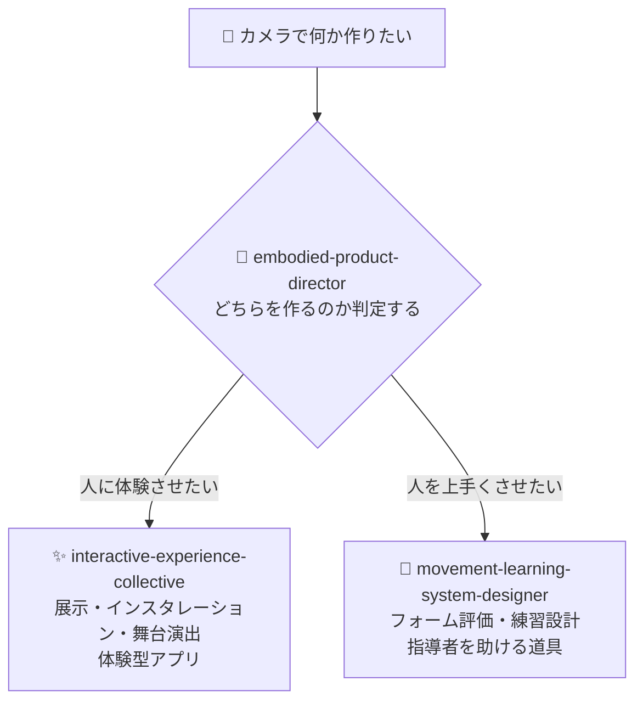

# ⚡ interactive-experience-skills

[](https://opensource.org/licenses/MIT)
[](https://claude.com/claude-code)


[English](README.md) · **日本語** · [简体中文](README.zh-CN.md) · [Español](README.es.md) · [한국어](README.ko.md)

> **カメラやセンサーを使って「人に体験させるもの」か「人が上手くなる道具」を作る。その設計を、何を作るか決めるところから手伝う Claude Code スキルです。**

---

## 🔰 これは何？

カメラやセンサーで人の動きを読み取って何かを作りたい、というときに使うスキルです。作れるものは、大きく分けて次の2種類あります。

**① 人に体験させるもの**
美術館やイベント会場で見かける、人の動きに反応して映像や音が変わる展示。プロジェクションマッピング、インスタレーション、舞台演出、体験型のアプリなど。**目的は、来た人に何かを感じさせることです。**

**② 人が上手くなるための道具**
ダンス、武術、スポーツ、ヨガのように「フォームが大事」なものを、カメラで撮って評価したり、直すべき点を伝えたり、練習を設計したりするツール。**目的は、使う人が実際に上達することです。**

この2つは、必要な技術も、使う人も、お金を払う人も、成功の測り方もまったく違います。それなのに、どちらを作るのかを決めないまま「TouchDesigner がいいか」「姿勢推定の精度をどう上げるか」といった技術の話を始めてしまうのが、この分野で最もよくある失敗です。**このスキル群は、そこを決めるところから始めます。**

### 具体的に何をしてくれるのか

やり取りの例です。

> **あなた:**「Webカメラが2台余ってる。武術の稽古で何か作りたいけど、方向が決まらない」
>
> **スキル:** まず「これは作品ですか、それとも稽古の道具ですか」を判定します。稽古の道具だと決まれば → 誰が使うのか（生徒か、先生か）、誰がお金を払うのか（生徒か、道場の経営者か）、いま何に困っているのか（先生が全員を見きれない？ 生徒がクラス間で指摘を忘れる？）を整理します。そのうえで「2台目のカメラは今は要りません。1台で、1つの技だけを、練習後に振り返る形から始めてください」といった判断を、理由とともに返します。

**コードは書きません。** 返ってくるのは、何を作るべきか / どんな機材がどれくらい必要か / 何から検証するか / 逆に今は何を作らないか、という設計の判断です。実装はそのあと、普通に Claude Code に頼めば進みます。

---

## 📐 システム概念図



実際に設計をするのは下の2つです。上のディレクターは、どちらに進むかを決めるだけの案内役です。

**作るものが最初から決まっている場合、ディレクターは出てきません。**「道場向けのフォーム比較アプリを設計して」と書けば、下の🥋が直接動きます。ディレクターが要るのは「まだ決まっていない」ときだけです。

---

## ✨ 3つの強み

### 🧭 「体験させるもの」か「上手くさせる道具」かを、必ず一つに決める
「ダンスのアプリを作りたい」と言われたとき、それが振付を覚えるための道具なのか、見て楽しむ作品なのかで、作るものは別物になります。このスキルは「どちらとも言えますね」で終わらせません。理由をつけて片方に決めます。決めないまま進むことが、いちばん高くつくからです。

### 📐 「没入的」「AIで」ではなく、数字で答える
暗い部屋で3m幅に投影するなら 5,000〜8,000 ルーメン。体を使ったフィードバックは 100ミリ秒以内に返さないと「自分の動き」だと感じられない。踏み込みの深さは正面のカメラでは測れないので側面が要る。有料の体験施設なら、単価 × 回転率 × 稼働日数で採算が合うか計算する。こうした具体を約96,000字ぶん持っていて、必要なときだけ読み込みます。

### 🚫 やってはいけないことを、はっきり断る
痛みや怪我は判定しません（医療の領域なので）。自信がないときは、それらしいことを言わずに「今回は判定できません」と黙ります（一度でも明らかに間違った指摘をすると、経験者はそのシステムを二度と使わないからです）。子どもを撮影する案件では、技術の話より先に保護者の同意の話をします。そして**「姿勢推定の精度が上がれば人は上達する」という思い込みを、はっきり否定します。**

---

## 🔄 導入前 / 導入後

| | 導入前 | 導入後 |
|---|---|---|
| 相談の出だし | 「カメラが2台ある。何が作れる？」 | 「どの困りごとになら、2台目が値段ぶんの価値を出すか」 |
| 作品か道具か | 決まらないまま実装が始まる | 最初に片方へ決める。理由つきで |
| 技術の答え | 「没入感のあるAI体験を」 | 5,000〜8,000ルーメン・100ミリ秒・カメラは1台で足りる |
| 1人で作る場合 | 「本物の劣化版」として扱われる | それが最終形かつ最適形でありうる、として扱う |
| 姿勢推定 | 「精度を上げれば上達する」 | 精度と上達は無関係。上達のために設計し直す |

---

## 🚀 インストールと使い方

[Claude Code](https://claude.com/claude-code)、`git`、`bash`、`zip` が必要です。インストーラーは bash スクリプトなので、macOS / Linux / WSL で実行してください。

### 🖥️ Claude Code（CLI）

```bash
git clone https://github.com/takaoumehara/interactive-experience-skills.git
cd interactive-experience-skills
./install.sh
```

確認の行が5つ（スキル3本とコマンド2つ）出れば成功です。インストーラーは、各スキルが「読む」と宣言しているファイルが実在するかを先に検証し、1つでも欠けていれば何もコピーせずに中止します。

配置先はこちらです。

```
~/.claude/skills/embodied-product-director/
~/.claude/skills/interactive-experience-collective/
~/.claude/skills/movement-learning-system-designer/
~/.claude/commands/motion-idea.md
~/.claude/commands/refresh-skills.md
```

新しいセッションを開いて、方向が決まっていないならコマンドで、

```
/motion-idea Webカメラが2台余ってる。武術の稽古で何か作りたい
```

作るものが決まっているなら、そのまま普通に書いてください。該当するスキルが自動で立ち上がります。

```
ダンサーの動きに反応するプロジェクションマッピングを設計して
```

```
空手の突きのフォームを先生のお手本と比べられるアプリのMVPを設計して
```

### 🌐 claude.ai（ブラウザ）

配布用の `.skill` ファイルを同梱しています。中身はただの zip なので、拡張子を変えればそのままアップロードできます。

```bash
cp movement-learning-system-designer.skill movement-learning-system-designer.zip
```

この `.zip` をスキル設定からアップロードしてください。手順は [Claude Docs](https://docs.claude.com/ja/docs/agents-and-tools/agent-skills/overview) を参照してください。

> GitHub 上で `.skill` ファイルを開くと中身が表示されませんが、壊れているわけではありません。GitHub がこの拡張子を知らないため、プレビューできないだけです。ダウンロードして `unzip -l` すれば中身を確認できます。

### 🛠️ ソースから

編集する正本は `.skill` ではなく `_extracted/` です。

```
_extracted/<skill>/SKILL.md
_extracted/<skill>/references/*.md
_extracted/<skill>/evals/evals.json
```

`SKILL.md` は起動時に必ず読まれる本体、`references/*.md` は必要になったときだけ読まれる詳細、`evals/evals.json` はスキルが正しく起動するかのテストです。

編集後に `./install.sh` を実行すると、`~/.claude/` への配置と `.skill` の再パッケージを冪等に行います。

手動で入れる場合は `_extracted/` 配下の3ディレクトリを `~/.claude/skills/` にコピーしてください。

---

## 🔁 スキルを最新に保つ

このスキルには、製品名・価格帯・ライブラリ名・スペックの数字が入っています。**放っておくと必ず古くなります。**対策は2段構えです。

### ① 使うたびに確認させる（自動・設定不要）

リファレンスの、古くなりうる記述には次の印が付いています。

```markdown
<!-- volatile: 2026-07 -->
```

この印が付いた箇所を読んだとき、スキルは**その場で Web 検索して現状を確認してから**答えます。あなたは何もしなくて構いません。

### ② 定期的にまとめて更新する（手動・月1回程度）

```
/refresh-skills
```

このコマンドは、`volatile` の印が付いた記述を全部集めて Web で調べ直し、**変わっているものだけ**を一覧で出します。勝手に書き換えはしません。あなたが見て納得したものだけ反映してください。

```
/refresh-skills apply
```

と打てば、確認した内容をファイルに反映して `install.sh` まで実行します。

自動で定期実行したい場合は、Claude Code のセッションで次のように打つとバックグラウンドで回せます。

```
/loop 30d /refresh-skills
```

---

## 🧭 設計上の立場

このスキル群が守っているものです。

- **追跡精度と学習効果は別物です。** 姿勢推定が正確でも、人が上達する保証は一切ありません
- **「正解」は誰かの意見です。** 参照フォームは中立な真理ではなく、特定の指導者の見解を権威として固定しています。出典を示し、指導者が上書きできるようにします
- **確信が持てない時は黙ります。** 沈黙は欠陥ではなく機能です
- **痛み・怪我・可動域は判定しません。** 臨床専門家の関与なしにリハビリへ踏み込みません
- **未成年の撮影は、保護者同意と保存方針が技術より先に来ます**
- **制約が削るべきなのは不要な制作の複雑さであって、創造的野心ではありません**

---

## 🛠️ 開発

SKILL.md には判断基準を置き、references へ出すのは**特定のモードでしか使わない手順**だけです。判断基準をリファレンスへ追い出すと「読まずに一般論を書く」失敗が起きます。

サブスキルへの分割はしていません。常時ロードされる説明文が増えるほど、このスキル群で最も難しい「体験させるものか、上手くさせる道具か」の判定精度が落ちるためです。3スキル構成での振り分け精度は実測で97%、判定に迷う率は11%です。

`_extracted/<skill>/evals/evals.json` に、起動すべきクエリと起動すべきでないクエリを置いています。「起動すべきでない」側の大半は無関係なクエリではなく、**もう一方のスキルへ行くべき紛らわしい例**です。説明文を編集したらこのセットで確認してください。

---

## 🔄 更新され続けること

インタラクティブ体験の分野は、事実の面が速く動きます。センサーが販売終了になり、GPUの価格が2倍になり、OSの更新でボディトラッキングAPIが静かに壊れ、規制の施行日が変わります。**去年の価格を自信を持って答えるスキルは、何も答えないスキルより有害です。**

4つの仕組みが、それぞれ1つの仕事だけをします。

| 仕組み | 仕事 |
|---|---|
| リファレンス冒頭の `<!-- volatile: YYYY-MM -->` | **索引。** そのファイルの何が腐るかを名指しする |
| `references/current.md` | **答えの置き場。** 今どうなのかを、日付・出典・確度つきで書く |
| `/refresh-skills` | **随時。** 印の項目をWeb検索で照合し、**変わったものだけ**報告する |
| `maintenance/UPDATE-ROUTINE.md` | **月次。** 照合し、答えを記録し、履歴を残し、PRを出す |

回答時は「印の付いた記述を使う → まず `current.md` を見る → 無いか6ヶ月以上前なら検索 → そうでなければ時点を添えて出す」と流れます。

`maintenance/UPDATE-ROUTINE.md` には、間違えやすい部分も書いてあります。**何を反映し、何を反映しないか。そして「足した分だけ削る」という分量の規律です。**`CHANGELOG.md` には、変えたもの、**あえて変えなかったもの**、そして**そもそも調べていないもの**を記録します。

---

## 📄 ライセンス

MIT — [LICENSE](LICENSE) を参照してください。

この領域（身体・動き・カメラ・空間の体験設計、技術選定、事業性の検証）の相談を受けています。Issue からご連絡ください。
