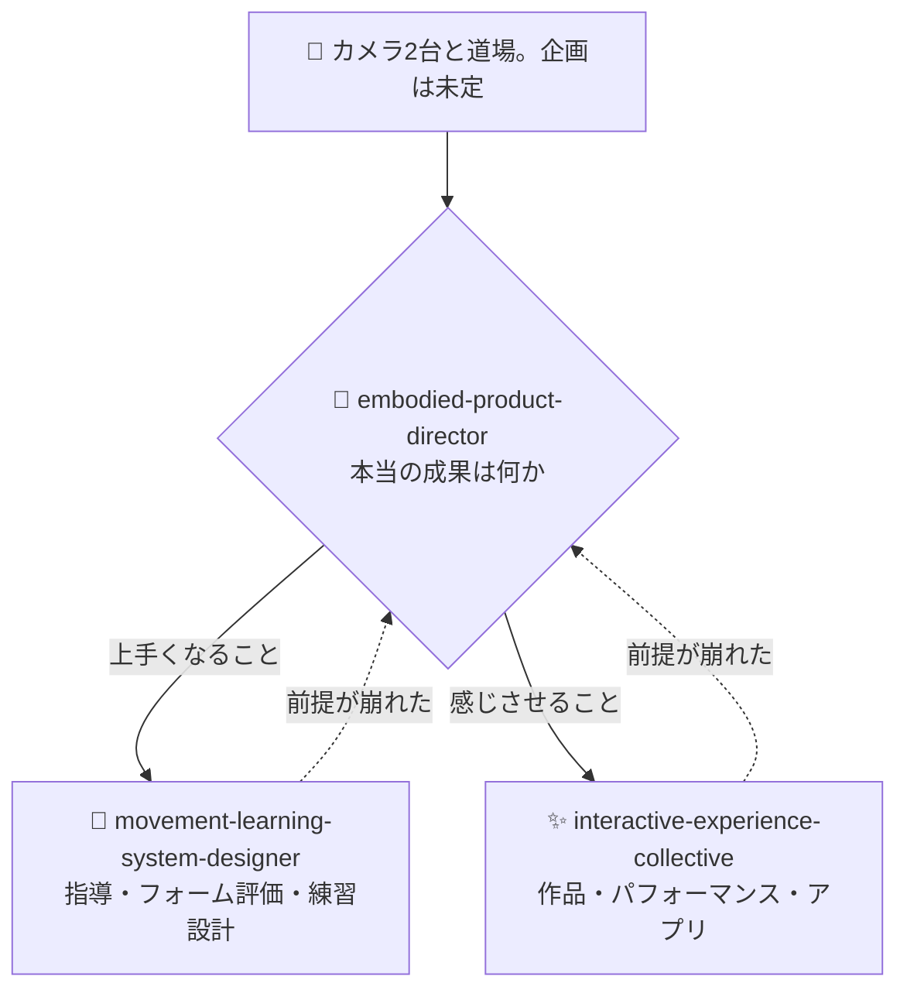

# ⚡ interactive-experience-skills

[](https://opensource.org/licenses/MIT)
[](https://claude.com/claude-code)


[English](README.md) · **日本語** · [简体中文](README.zh-CN.md) · [Español](README.es.md) · [한국어](README.ko.md)

> **カメラもセンサーも選ぶ前に、それが作品なのか製品なのかを決める。**

---

## 🔰 これは何？

*非エンジニア向け:* カメラが2台あって、何か面白いものが作れそうな気がする。この状態で普通に相談すると、いきなり「どのソフトを使うか」の話になります。良いディレクターは逆をやります。まず、これは誰のためのもので、何が良くなって、誰が金を払うのかを聞く。機材の話はその後です。

身体・動き・カメラ・空間に関わる企画で、Claude をそのディレクターとして動かす3つの Claude Code スキルです。

---

## 📐 システム概念図



領域と成果物が既に明確な依頼は、director を通さず専門スキルが直接発火します。director は方向が定まっていない相談専用の入口であり、自動の関所ではありません。

---

## ✨ 3つの強み

### 🧭 キーワードではなく成果でルーティングする
「ダンス」は振付学習・メディアアート・創作道具・フィットネス・リハビリのどれでもありえます。判定に使う問いは常に一つ、**成果は「上手くなること」か「感じさせること」か**だけ。そして「どちらとも言えない」で止めず、理由を添えて一つに決めます。

### 📐 判断に使える具体を返す
暗室3m幅の投影に必要なのは 5,000〜8,000 lm。身体フィードバックの遅延予算は 100 ms。踏み込み量が正面カメラでは測れず側面が要ること。有料体験の損益分岐の計算式。リファレンスは約96,000字あり、モードが必要とする分だけ読み込みます。

### 🚫 踏み込まない線を持っている
痛み・怪我・可動域は判定しません。確信が持てない時は推測せず黙ります（熟練者は一度の明らかな誤判定でシステム全体を捨てるからです）。未成年の撮影では保護者同意が技術より先に来ます。そして**追跡精度と学習効果を混同しません。**

---

## 🔄 導入前 / 導入後

| | 導入前 | 導入後 |
|---|---|---|
| 出発点 | 「カメラが2台ある。何が作れる？」 | 「どの課題でなら2台目がコストに見合うか」 |
| 作品か製品か | 延々と議論が続く | 一つの問いで決着。理由付き |
| 技術的な答え | 「没入的」「AI活用」「未来的」 | 5,000〜8,000 lm・100 ms・カメラは1台で足りる |
| 個人開発の予算 | 劣化版として扱われる | 最終形かつ最適形でありうるものとして扱う |
| 姿勢推定 | 「精度が上がれば上達する」 | 精度と上達は無関係。上達のために設計する |

---

## 🚀 インストールと使い方

[Claude Code](https://claude.com/claude-code)、`git`、`bash`、`zip` が必要です。インストーラーは bash スクリプトなので、macOS / Linux / WSL を使ってください。

### 🖥️ Claude Code（CLI）

```bash
git clone https://github.com/takaoumehara/interactive-experience-skills.git
cd interactive-experience-skills
./install.sh
```

`配置:` の行が4つ（スキル3本と `/motion-idea` コマンド）出れば成功です。インストーラーは、各スキルが宣言しているリファレンスが実在するかを配置前に検証し、1つでも欠けていれば何もコピーせずに中止します。

配置先はこちらです。

```
~/.claude/skills/embodied-product-director/
~/.claude/skills/interactive-experience-collective/
~/.claude/skills/movement-learning-system-designer/
~/.claude/commands/motion-idea.md
```

新しいセッションを開いて、コマンドで呼ぶか、

```
/motion-idea 2台のカメラで武術の稽古を何かしたい
```

自然文でそのまま書いてください。専門スキルは自分で発火します。

```
ダンサーの動きに反応するプロジェクションマッピングを設計して
```

### 🌐 claude.ai（ブラウザ）

配布用の `.skill` アーカイブを同梱しています。中身はただの zip です。

```bash
cp embodied-product-director.skill embodied-product-director.zip
```

この `.zip` をスキル設定からアップロードしてください。手順は [Claude Docs](https://docs.claude.com/ja/docs/agents-and-tools/agent-skills/overview) を参照してください。

### 🛠️ ソースから

編集する正本は `.skill` ではなく `_extracted/` です。

```
_extracted/<skill>/SKILL.md
_extracted/<skill>/references/*.md
_extracted/<skill>/evals/evals.json
```

`SKILL.md` は起動時に必ず読まれる本体、`references/*.md` はモードが要求した時だけ読まれる詳細、`evals/evals.json` はトリガー判定のテストセットです。

編集後に `./install.sh` を実行すると、`~/.claude/` への配置と `.skill` の再パッケージを冪等に行います。

手動で入れる場合は `_extracted/` 配下の3ディレクトリを `~/.claude/skills/` にコピーしてください。

---

## 🧭 設計上の立場

このスキル群が守っているものです。

- **追跡精度と学習効果は別物です。** 姿勢推定が正確でも、人が上達する保証は一切ありません
- **「正解」は誰かの意見です。** 参照フォームは中立な真理ではなく、特定の指導者の見解を権威として固定しています。出典を示し、指導者が上書きできるようにします
- **確信が持てない時は黙ります。** 沈黙は欠陥ではなく機能です
- **痛み・怪我・可動域は判定しません。** 臨床専門家の関与なしにリハビリへ踏み込みません
- **未成年の撮影は、保護者同意と保存方針が技術より先に来ます**
- **制約が削るべきなのは不要な制作の複雑さであって、創造的野心ではありません**

---

## 🛠️ 開発

SKILL.md には判断基準を置き、references へ出すのは**特定のモードでしか使わない手順**だけです。判断基準をリファレンスへ追い出すと「読まずに一般論を書く」失敗が起きます。

サブスキルへの分割はしていません。常時ロードされる description が増えるほど、このスキル群で最も難しい「表現か上達か」の判定精度が落ちるためです。3スキル構成でのルーティング精度は実測で97%、判定に迷う率は11%です。

`_extracted/<skill>/evals/evals.json` に、発火すべきクエリと発火すべきでないクエリを置いています。「発火すべきでない」側の大半は無関係なクエリではなく、**姉妹スキルへ行くべき near-miss** です。description を編集したらこのセットで確認してください。判定は Claude に行わせます。

---

## 📄 ライセンス

MIT — [LICENSE](LICENSE) を参照してください。

この領域（身体・動き・カメラ・空間の体験設計、技術選定、事業性の検証）の相談を受けています。Issue からご連絡ください。
