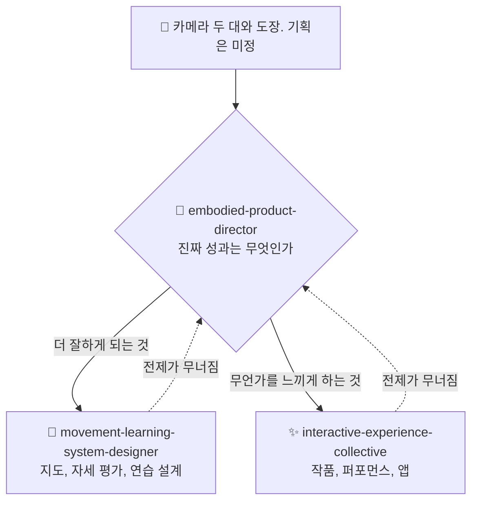

# ⚡ interactive-experience-skills

[](https://opensource.org/licenses/MIT)
[](https://claude.com/claude-code)


[English](README.md) · [日本語](README.ja.md) · [简体中文](README.zh-CN.md) · [Español](README.es.md) · **한국어**

> **카메라도 센서도 프레임워크도 고르기 전에, 이것이 작품인지 제품인지부터 정합니다.**

> **참고:** 세 skill의 본문은 일본어로 작성되어 있습니다. Claude는 어떤 언어로든 읽고 적용하지만, 파일을 직접 열면 일본어를 보게 됩니다. 이 README는 설치하기 전에 자신에게 맞는지 판단할 수 있도록 만들었습니다.

---

## 🔰 이게 뭔가요?

*비개발자를 위한 설명:* 카메라가 두 대 있고, 뭔가 재미있는 걸 만들 수 있을 것 같은 느낌이 든다고 해봅시다. 보통의 조언은 곧바로 어떤 소프트웨어를 쓸지로 넘어갑니다. 좋은 디렉터는 반대로 합니다. 먼저 이게 누구를 위한 것인지, 실제로 무엇이 좋아지는지, 누가 돈을 내는지를 묻습니다. 장비 이야기는 그다음입니다.

몸, 움직임, 카메라, 공간이 얽힌 프로젝트에서 Claude가 그런 디렉터처럼 움직이게 하는 세 개의 Claude Code skill입니다.

---

## 📐 시스템 구조



영역과 산출물이 이미 명확한 요청은 director를 거치지 않고 전문 skill이 바로 실행됩니다. director는 방향이 정해지지 않은 프로젝트를 위한 입구이지, 반드시 지나야 하는 관문이 아닙니다.

---

## ✨ 3가지 강점

### 🧭 키워드가 아니라 성과로 분기합니다
「댄스」는 안무 학습일 수도, 미디어 아트일 수도, 창작 도구일 수도, 피트니스일 수도, 재활일 수도 있습니다. 판단에 쓰는 질문은 언제나 하나입니다. **성과가 「더 잘하게 되는 것」인가 「느끼게 하는 것」인가.** 그리고 「둘 다 해당된다」로 멈추지 않고, 이유를 붙여 하나를 고릅니다.

### 📐 바로 쓸 수 있는 숫자로 답합니다
암실에서 3 m 폭으로 투사하려면 5,000〜8,000 lm이 필요합니다. 신체 피드백의 지연 예산은 100 ms입니다. 정면 카메라로는 발을 내딛는 거리를 측정할 수 없고 측면이 필요하다는 것. 유료 체험의 손익분기 계산식. 약 96,000자의 참고 자료가 있고, 해당 모드가 필요로 할 때만 읽어 들입니다.

### 🚫 넘지 않는 선을 알고 있습니다
통증, 부상, 관절 가동 범위는 판정하지 않습니다. 확신이 부족할 때는 추측하지 않고 침묵합니다. 숙련자는 한 번의 명백한 오판으로 시스템 전체를 버리기 때문입니다. 미성년자를 촬영할 때는 보호자 동의가 기술보다 먼저입니다. 그리고 추적 정확도를 학습 효과와 혼동하지 않습니다.

---

## 🔄 도입 전 / 도입 후

| | 도입 전 | 도입 후 |
|---|---|---|
| 출발점 | 「카메라가 두 대 있는데 뭘 만들 수 있죠?」 | 「어떤 문제에서 두 번째 카메라가 비용값을 하는가」 |
| 작품인가 제품인가 | 끝없이 논의만 이어짐 | 하나의 질문으로 결정. 이유까지 명시 |
| 기술적인 답변 | 「몰입형」「AI 기반」「미래적」 | 5,000〜8,000 lm · 100 ms · 카메라 한 대면 충분 |
| 1인 개발 예산 | 축소판으로 취급 | 최종형이자 최적형일 수 있는 것으로 취급 |
| 자세 추정 | 「정확도가 오르면 더 잘하게 된다」 | 정확도와 학습은 무관. 학습을 위해 설계할 것 |

---

## 🚀 설치 및 사용법

[Claude Code](https://claude.com/claude-code), `git`, `bash`, `zip`이 필요합니다. 설치 스크립트는 bash로 작성되어 있으므로 macOS, Linux 또는 WSL에서 실행하십시오.

### 🖥️ Claude Code (CLI)

```bash
git clone https://github.com/takaoumehara/interactive-experience-skills.git
cd interactive-experience-skills
./install.sh
```

배치 완료를 알리는 줄이 네 개 출력되면 성공입니다. skill 세 개와 `/motion-idea` 명령어입니다. 설치 스크립트는 각 skill이 선언한 참조 파일이 실제로 존재하는지 먼저 확인하고, 하나라도 없으면 아무것도 복사하지 않고 중단합니다.

설치 위치는 다음과 같습니다.

```
~/.claude/skills/embodied-product-director/
~/.claude/skills/interactive-experience-collective/
~/.claude/skills/movement-learning-system-designer/
~/.claude/commands/motion-idea.md
```

새 Claude Code 세션을 열고 명령어로 호출하거나,

```
/motion-idea 카메라 두 대로 무술 수련과 관련해서 뭔가 만들고 싶습니다
```

그냥 자연어로 프로젝트를 설명하십시오. 전문 skill이 알아서 실행됩니다.

```
무용수의 움직임에 반응하는 프로젝션 매핑을 설계해 주세요
```

### 🌐 claude.ai (브라우저)

저장소에는 각 skill이 패키지로 포함되어 있습니다. 평범한 zip 파일입니다.

```bash
cp embodied-product-director.skill embodied-product-director.zip
```

이 `.zip`을 어시스턴트의 skill 설정에서 업로드하십시오. 현재 업로드 절차는 [Claude Docs](https://docs.claude.com/en/docs/agents-and-tools/agent-skills/overview)를 참고하십시오.

### 🛠️ 소스에서 직접

편집 대상은 `.skill` 아카이브가 아니라 `_extracted/`입니다.

```
_extracted/<skill>/SKILL.md
_extracted/<skill>/references/*.md
_extracted/<skill>/evals/evals.json
```

`SKILL.md`은 실행될 때마다 로드되는 본문이고, `references/*.md`는 해당 모드가 필요로 할 때만 로드되며, `evals/evals.json`은 실행 조건 테스트 세트입니다.

수정한 뒤 `./install.sh`를 다시 실행하면 `~/.claude/`로의 배치와 `.skill` 재패키징을 멱등하게 수행합니다.

수동으로 설치하려면 `_extracted/` 아래의 세 디렉터리를 `~/.claude/skills/`로 복사하면 됩니다.

---

## 📄 라이선스

MIT — [LICENSE](LICENSE)를 참고하십시오.

이 영역에 대한 컨설팅도 받고 있습니다. 신체, 움직임, 카메라, 공간 경험의 설계와 기술 선정, 사업성 검증입니다. issue로 연락 주십시오.
