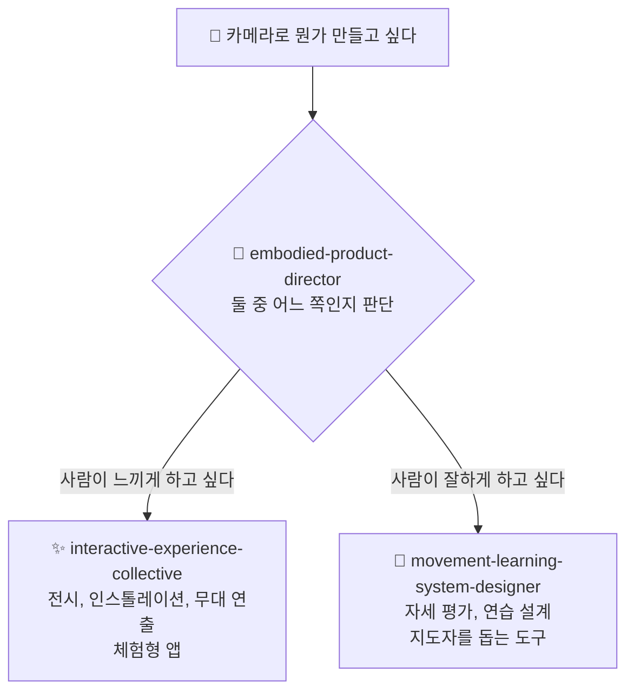

# ⚡ interactive-experience-skills

[](https://opensource.org/licenses/MIT)
[](https://claude.com/claude-code)


[English](README.md) · [日本語](README.ja.md) · [简体中文](README.zh-CN.md) · [Español](README.es.md) · **한국어**

> **카메라와 센서로, 사람이 체험하는 무언가를 만들거나, 사람이 동작을 더 잘하게 되는 도구를 만듭니다. 이 세 개의 Claude Code skill은 「둘 중 무엇을 만들 것인가」를 정하는 데서부터 설계를 도와줍니다.**

> **참고:** 세 skill의 본문은 일본어로 작성되어 있습니다. Claude가 어떤 언어로든 읽고 적용하므로 한국어로만 작업해도 됩니다. 다만 파일을 직접 열면 일본어를 보게 됩니다.

---

## 🔰 이게 뭔가요?

카메라나 센서로 사람의 움직임을 읽어서 무언가를 만들고 싶을 때 쓰는 skill입니다. 만들 수 있는 것은 크게 두 종류로 나뉩니다.

**① 사람이 체험하는 것**
미술관이나 행사장에서 볼 수 있는, 사람의 움직임에 따라 영상과 소리가 반응하는 전시물. 프로젝션 매핑, 인스톨레이션, 무대 연출, 체험형 앱. **목표는 찾아온 사람이 무언가를 느끼게 하는 것입니다.**

**② 사람이 더 잘하게 되는 도구**
자세가 중요한 분야 — 댄스, 무술, 스포츠, 요가 — 에서 카메라로 촬영하고, 동작을 평가하고, 무엇을 고쳐야 하는지 알려주고, 연습을 설계하는 도구. **목표는 쓰는 사람이 실제로 향상되는 것입니다.**

이 둘은 필요한 기술도, 사용자도, 돈을 내는 사람도, 성공의 기준도 전혀 다릅니다. 그런데 이 분야에서 가장 흔한 실패는, 둘 중 무엇을 만들지 정하기도 전에 「TouchDesigner인가 Unreal인가」「자세 추정 정확도를 어떻게 올릴까」부터 논의하기 시작하는 것입니다. **이 skill들은 바로 그것을 정하는 데서 시작합니다.**

### 구체적으로 무엇을 해주나요

실제 대화는 이런 식입니다.

> **당신:** 「웹캠이 두 대 남는데, 무술 수련으로 뭔가 만들고 싶습니다. 그런데 방향이 안 잡힙니다.」
>
> **skill:** 먼저 이것이 작품인지 훈련 도구인지를 판단합니다. 훈련 도구라면 → 누가 쓰는지(수련생인가 사범인가), 누가 돈을 내는지(수련생인가 도장 운영자인가), 지금 실제로 무엇이 문제인지(사범이 전원을 다 볼 수 없다? 수련생이 수업 사이에 지적을 잊는다?)를 정리합니다. 그리고 결론을 냅니다. 「두 번째 카메라는 아직 필요 없습니다. 카메라 한 대로, 기술 하나만, 실시간이 아니라 수련이 끝난 뒤에 돌아보는 형태로 시작하십시오.」 이유와 함께 말입니다.

**코드는 작성하지 않습니다.** 돌아오는 것은 설계 판단입니다. 무엇을 만들지, 어떤 장비가 얼마나 필요한지, 무엇부터 검증할지, 반대로 지금은 무엇을 만들지 않을지. 구현은 그다음에 Claude Code에 평범하게 맡기면 됩니다.

---

## 📐 시스템 구조



실제로 설계를 하는 것은 아래 두 개입니다. 위의 director는 어느 쪽으로 갈지 정하는 안내 역할만 합니다.

**만들 것이 이미 정해져 있다면 director는 아예 나오지 않습니다.** 「도장용 자세 비교 앱의 MVP를 설계해 주세요」라고 쓰면 🥋 쪽이 바로 시작합니다. director가 필요한 것은 아직 정하지 못했을 때뿐입니다.

---

## ✨ 3가지 강점

### 🧭 반드시 둘 중 하나로 결정합니다
「댄스 앱을 만들고 싶다」는 안무를 외우기 위한 도구일 수도 있고, 보면서 즐기는 작품일 수도 있습니다. 그리고 이 둘은 완전히 다른 제품입니다. 이 skill은 「둘 다 될 수 있겠네요」로 끝내지 않습니다. 하나를 고르고 이유를 말합니다. 고르지 않는 것이 가장 비싼 대가를 치릅니다.

### 📐 「몰입형」「AI 기반」이 아니라 숫자로 답합니다
어두운 방에서 3 m 폭으로 투사하려면 5,000–8,000 루멘. 신체 동작에 대한 피드백은 100 ms 안에 돌아오지 않으면 「내 움직임」이라고 느껴지지 않습니다. 정면 카메라로는 발을 얼마나 깊이 내딛었는지 측정할 수 없으므로 측면이 필요합니다. 유료 시설이라면 객단가 × 회전율 × 운영일수로 사업이 성립하는지가 결정됩니다. 이런 내용이 약 96,000자 있고, 지금의 질문이 필요로 할 때만 읽어 들입니다.

### 🚫 안 되는 것은 분명히 거절합니다
통증이나 부상은 판정하지 않습니다. 그것은 의학의 영역입니다. 확신이 없을 때는 그럴듯한 답을 만들어내지 않고 「이번에는 판정할 수 없습니다」라고 말합니다. 명백하게 틀린 지적을 한 번만 해도 경험자는 그 시스템을 영영 쓰지 않기 때문입니다. 어린이가 관련된 프로젝트에서는 기술 이야기보다 보호자 동의를 먼저 꺼냅니다. 그리고 **자세 추정 정확도가 올라가면 사람이 더 잘 배운다**는 믿음을 명확하게 부정합니다.

---

## 🔄 도입 전 / 도입 후

| | 도입 전 | 도입 후 |
|---|---|---|
| 대화의 시작 | 「카메라가 두 대 있는데 뭘 만들 수 있죠?」 | 「어떤 문제에서 두 번째 카메라가 값어치를 하는가」 |
| 작품인가 도구인가 | 정해지지 않은 채 구현이 시작됨 | 먼저 결정. 이유까지 함께 |
| 기술적인 답변 | 「AI 기반의 몰입형 경험을」 | 5,000–8,000 lm · 100 ms · 카메라 한 대면 충분 |
| 혼자 만들 때 | 진짜의 축소판으로 취급 | 최종형이자 최적형일 수 있는 것으로 취급 |
| 자세 추정 | 「정확도를 올리면 더 잘 배운다」 | 무관합니다. 학습을 위해 다시 설계해야 합니다 |

---

## 🚀 설치 및 사용법

[Claude Code](https://claude.com/claude-code), `git`, `bash`, `zip`이 필요합니다. 설치 스크립트는 bash로 작성되어 있으므로 macOS, Linux 또는 WSL에서 실행하십시오.

### 🖥️ Claude Code (CLI)

```bash
git clone https://github.com/takaoumehara/interactive-experience-skills.git
cd interactive-experience-skills
./install.sh
```

확인 메시지가 다섯 줄 출력되면 성공입니다(스크립트는 일본어로 출력합니다). skill 세 개와 명령어 두 개입니다. 무엇을 복사하기 전에, 설치 스크립트는 각 skill이 읽겠다고 선언한 파일이 실제로 존재하는지 먼저 확인하고, 하나라도 없으면 중단합니다.

설치 위치는 다음과 같습니다.

```
~/.claude/skills/embodied-product-director/
~/.claude/skills/interactive-experience-collective/
~/.claude/skills/movement-learning-system-designer/
~/.claude/commands/motion-idea.md
~/.claude/commands/refresh-skills.md
```

새 세션을 엽니다. 아직 방향이 없다면 명령어를 쓰십시오.

```
/motion-idea 웹캠이 두 대 남는데 무술 수련으로 뭔가 만들고 싶습니다
```

만들 것이 이미 정해져 있다면 그냥 평범하게 쓰면 됩니다. 해당하는 skill이 알아서 시작합니다.

```
무용수의 움직임에 반응하는 프로젝션 매핑을 설계해 주세요
```

```
가라테 지르기를 사범의 시범과 비교하는 앱의 MVP를 설계해 주세요
```

### 🌐 claude.ai (브라우저)

각 skill은 `.skill` 파일로 패키징되어 있습니다. 평범한 zip이므로 확장자만 바꾸면 그대로 업로드할 수 있습니다.

```bash
cp movement-learning-system-designer.skill movement-learning-system-designer.zip
```

이 `.zip`을 어시스턴트의 skill 설정에서 업로드하십시오. 현재 절차는 [Claude Docs](https://docs.claude.com/en/docs/agents-and-tools/agent-skills/overview)를 참고하십시오.

> GitHub에서 `.skill` 파일을 열면 아무것도 표시되지 않습니다. 파일이 깨진 것이 아니라, GitHub이 이 확장자를 몰라서 미리보기를 못 할 뿐입니다. 내려받아 `unzip -l`을 실행하면 내용을 확인할 수 있습니다.

### 🛠️ 소스에서 직접

편집 대상은 `.skill` 아카이브가 아니라 `_extracted/`입니다.

```
_extracted/<skill>/SKILL.md
_extracted/<skill>/references/*.md
_extracted/<skill>/evals/evals.json
```

`SKILL.md`은 실행될 때마다 로드되는 본문이고, `references/*.md`는 지금의 모드가 필요로 할 때만 로드되며, `evals/evals.json`은 skill이 실행되어야 할 때 제대로 실행되는지를 확인하는 테스트입니다.

수정한 뒤 `./install.sh`를 다시 실행하면 `~/.claude/`로의 배치와 `.skill` 재패키징을 멱등하게 수행합니다.

수동으로 설치하려면 `_extracted/` 아래의 세 디렉터리를 `~/.claude/skills/`로 복사하면 됩니다.

---

## 🔁 skill을 최신 상태로 유지하기

이 skill들에는 제품명, 가격대, 라이브러리 이름, 하드웨어 수치가 들어 있습니다. **이런 것들은 반드시 낡습니다.** 대책은 두 겹입니다.

### ① 쓰는 순간에 확인 (자동, 설정 불필요)

낡을 수 있는 참고 내용에는 다음 표시가 붙어 있습니다.

```markdown
<!-- volatile: 2026-07 -->
```

skill이 표시가 붙은 부분을 읽으면, **그 자리에서 웹을 검색해 현재 상황을 확인한 뒤에 답합니다.** 당신이 할 일은 없습니다.

### ② 정기적으로 한꺼번에 갱신 (수동, 대략 월 1회)

```
/refresh-skills
```

표시가 붙은 주장을 전부 모아 웹에서 다시 확인하고, **실제로 바뀐 것만** 목록으로 냅니다. 파일은 건드리지 않습니다. 당신이 보고 판단하십시오.

```
/refresh-skills apply
```

확인된 내용을 파일에 반영하고, 표시의 연월을 갱신하고, `install.sh`까지 실행합니다. 출처를 제시할 수 있는 것만 반영됩니다.

정기적으로 자동 실행하고 싶다면 Claude Code의 루프를 쓰십시오.

```
/loop 30d /refresh-skills
```

---

## 🧭 이 skill들의 입장

- **추적 정확도와 학습 효과는 별개입니다.** 자세 추정이 정확해도 사람이 향상된다는 보장은 전혀 없습니다
- **「정답」은 누군가의 의견입니다.** 참조 자세는 중립적인 진리가 아니라, 특정 지도자의 견해를 권위로 고정한 것입니다. 출처를 밝히고, 지도자가 덮어쓸 수 있게 해야 합니다
- **확신이 없을 때 침묵하는 것은 결함이 아니라 기능입니다**
- **통증, 부상, 관절 가동 범위는 판정하지 않습니다.** 임상 전문가의 참여 없이 재활 영역에 발을 들이지 않습니다
- **미성년자를 촬영할 때는 보호자 동의와 보관 방침이 기술보다 먼저입니다**
- **예산이 빠듯할 때 잘라내야 하는 것은 불필요한 제작 복잡도이지, 창작의 야심이 아닙니다**

---

## 🛠️ 개발

`SKILL.md`에는 판단 기준을 두고, `references/`로 옮기는 것은 **특정 모드에서만 쓰는 절차**뿐입니다. 판단 기준을 참고 파일로 밀어내면, 이 skill들이 막으려는 바로 그 실패 — 아무것도 읽지 않고 일반론을 쓰는 것 — 가 일어납니다.

의도적으로 더 잘게 쪼개지 않았습니다. system prompt에 상주하는 설명이 늘어날수록, 이 영역에서 가장 어려운 판단인 「체험인가 향상인가」의 정확도가 떨어지기 때문입니다. skill 세 개 구성의 실측 분기 정확도는 97%이고, 판단이 애매한 비율은 11%입니다.

`_extracted/<skill>/evals/evals.json`에는 각 skill이 실행되어야 할 질의와 실행되면 안 되는 질의가 들어 있습니다. 「실행되면 안 되는」 쪽 대부분은 무관한 질의가 아니라, **다른 쪽 skill로 가야 하는 헷갈리는 사례**입니다. 설명 문구를 수정한 뒤에는 이 세트로 다시 확인하십시오.

---

## 🔄 최신 상태 유지

인터랙티브 경험 분야는 사실의 층이 빠르게 변합니다. 센서가 단종되고, GPU 가격이 두 배가 되고, OS 업데이트로 바디 트래킹 API가 조용히 망가지고, 규제 시행일이 바뀝니다. **작년 가격을 자신 있게 답하는 스킬은 아무것도 답하지 않는 스킬보다 해롭습니다.**

네 가지 장치가 각각 한 가지 일만 합니다. 레퍼런스 상단의 `<!-- volatile: YYYY-MM -->`는 **색인**(그 파일의 어떤 종류의 서술이 부패하는지 지목), `references/current.md`는 **답의 저장소**(지금 어떤 상황인지를 날짜·출처·확신도와 함께), `/refresh-skills`는 **수시 대조**(바뀐 것만 보고), `maintenance/UPDATE-ROUTINE.md`는 **월간 루틴**(대조·기록·이력·PR)입니다.

답변 시 흐름: 표시된 서술 사용 → 먼저 `current.md` 확인 → 없거나 6개월 이상 지났으면 웹 검색 → 아니면 시점을 명시. `CHANGELOG.md`에는 무엇을 바꿨는지, **의도적으로 바꾸지 않은 것**, 그리고 **아예 조사하지 않은 것**을 기록합니다.

---

## 📄 라이선스

MIT — [LICENSE](LICENSE)를 참고하십시오.

이 영역에 대한 컨설팅도 받고 있습니다. 신체, 움직임, 카메라, 공간 경험의 설계와 기술 선정, 사업성 검증입니다. issue로 연락 주십시오.
