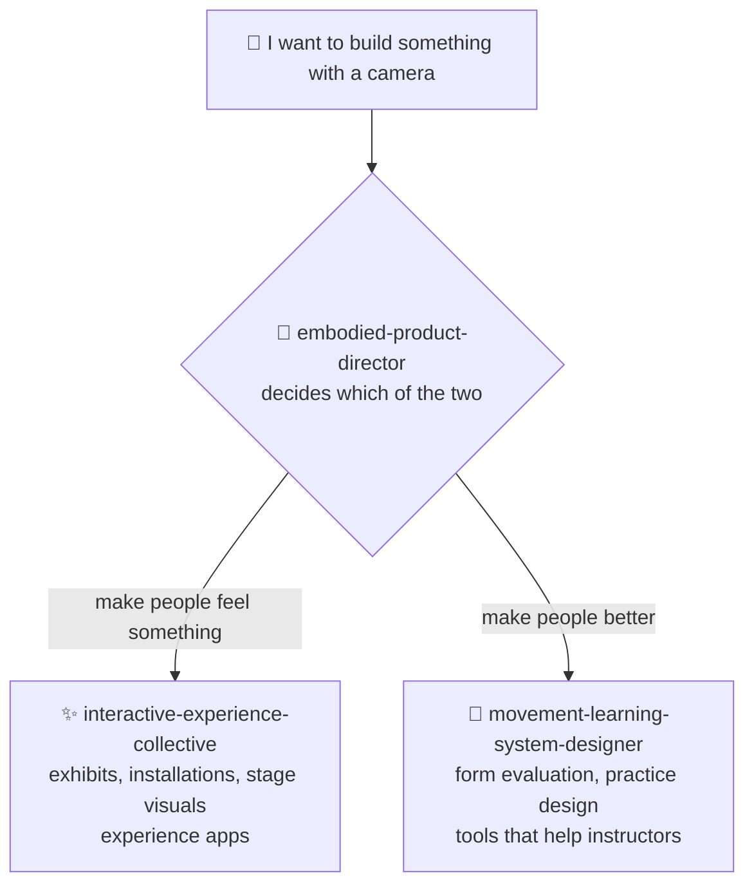

# ⚡ interactive-experience-skills

[](https://opensource.org/licenses/MIT)
[](https://claude.com/claude-code)


**English** · [日本語](README.ja.md) · [简体中文](README.zh-CN.md) · [Español](README.es.md) · [한국어](README.ko.md)

> **Build something people experience, or a tool that makes people better at a movement — using cameras and sensors. These Claude Code skills help you design it, starting from deciding which one you are making.**

> **Note:** The three skills are written in Japanese. Claude reads and applies them in any language, so you can work entirely in English. If you open the files yourself, you will be reading Japanese.

---

## 🔰 What is this?

Use these skills when you want to build something that reads human movement with a camera or a sensor. What you can build falls into two kinds.

**① Something people experience**
The kind of exhibit you see in a museum or at an event, where video and sound react to how people move. Projection mapping, installations, stage visuals, experience-driven apps. **The goal is to make a visitor feel something.**

**② A tool that makes people better**
For things where form matters — dance, martial arts, sports, yoga — a tool that films you, evaluates what you did, tells you what to fix, and designs your practice. **The goal is that the person actually improves.**

These two need different technology, different users, different people paying, and different definitions of success. Yet the most common failure in this field is to start arguing about TouchDesigner versus Unreal, or about pose-estimation accuracy, *before* deciding which of the two you are making. **These skills start by deciding that.**

### What you actually get

Here is what an exchange looks like.

> **You:** "I have two spare webcams. I want to build something around martial arts practice, but I have no direction."
>
> **The skill:** First it decides whether this is an artwork or a training tool. If it is a training tool → who uses it (the student or the teacher?), who pays (the student or the dojo owner?), and what is actually going wrong today (the teacher can't watch everyone? students forget the correction between classes?). Then it commits: "You don't need the second camera yet. Start with one camera, one technique, reviewed after practice rather than live" — with the reasoning.

**It does not write code.** What comes back is a design decision: what to build, roughly what equipment and how much of it, what to validate first, and what *not* to build yet. Implementation is a normal Claude Code job afterwards.

---

## 📐 Architecture



The two skills at the bottom do the actual design work. The director on top only decides which way you go.

**If you already know what you are building, the director never appears.** Write "design an MVP for a form-comparison app for a dojo" and the 🥋 skill starts directly. The director is only for when you have not decided yet.

---

## ✨ Features

### 🧭 It always commits to one of the two
"I want to make a dance app" can mean a tool for memorising choreography or a piece people watch for pleasure — and those are different products. This skill will not end on "well, it could be either." It picks one and tells you why. Not picking is what costs the most.

### 📐 It answers with numbers, not with "immersive" and "AI-powered"
5,000–8,000 lumens to project 3 m wide in a dark room. Feedback on a body movement has to come back within 100 ms or it stops feeling like *your* movement. A front-facing camera cannot measure how deep a step is, so you need a side view. For a paid venue, price × turnover × operating days decides whether it works at all. About 96,000 characters of this, loaded only when the current question needs it.

### 🚫 It says no clearly
It does not judge pain or injury — that is medicine. When it is not confident, it says "I can't judge this one" instead of producing something plausible, because a single obviously wrong correction makes an experienced person abandon the system forever. On projects involving children, it raises guardian consent before it discusses technology. And it flatly rejects the belief that **better pose-estimation accuracy makes people learn better.**

---

## 🔄 Before / After

| | Before | After |
|---|---|---|
| How the conversation starts | "We have two cameras — what can we build?" | "Which problem makes a second camera worth its price?" |
| Artwork or tool | Never settled; implementation starts anyway | Settled first, with the reason |
| The technical answer | "An immersive AI-powered experience" | 5,000–8,000 lm · 100 ms · one camera is enough |
| Building alone | Treated as a degraded version of the real thing | Treated as possibly the final and best form |
| Pose estimation | "More accuracy means people learn more" | Accuracy and learning are unrelated; redesign for learning |

---

## 🚀 Install & Usage

Requires [Claude Code](https://claude.com/claude-code), `git`, `bash`, and `zip`. The installer is a bash script, so run it on macOS, Linux, or WSL.

### 🖥️ Claude Code (CLI)

```bash
git clone https://github.com/takaoumehara/interactive-experience-skills.git
cd interactive-experience-skills
./install.sh
```

You should see five confirmation lines (the installer prints in Japanese) — three skills and two commands. Before copying anything, the installer checks that every file a skill declares it will read actually exists, and aborts if one is missing.

It installs to:

```
~/.claude/skills/embodied-product-director/
~/.claude/skills/interactive-experience-collective/
~/.claude/skills/movement-learning-system-designer/
~/.claude/commands/motion-idea.md
~/.claude/commands/refresh-skills.md
~/.claude/commands/scout-skills.md
```

Open a new session. If you have no direction yet, use the command:

```
/motion-idea I have two spare webcams and want to build something around martial arts practice
```

If you already know what you are building, just write it normally — the right skill starts on its own.

```
Design a projection mapping piece that reacts to a dancer
```

```
Design the MVP for an app that compares a karate punch against the instructor's
```

### 🌐 claude.ai (browser)

Each skill is bundled as a `.skill` file. It is an ordinary zip, so renaming it is enough to upload it.

```bash
cp movement-learning-system-designer.skill movement-learning-system-designer.zip
```

Upload the `.zip` in your assistant's skill settings — see the [Claude Docs](https://docs.claude.com/en/docs/agents-and-tools/agent-skills/overview) for the current flow.

> Opening a `.skill` file on GitHub shows nothing. It is not broken — GitHub simply does not recognise the extension and cannot preview it. Download it and run `unzip -l` to see the contents.

### 🛠️ From source

The editable source of truth is `_extracted/`, not the `.skill` archives.

```
_extracted/<skill>/SKILL.md
_extracted/<skill>/references/*.md
_extracted/<skill>/evals/evals.json
```

`SKILL.md` is loaded on every activation; `references/*.md` only when the current mode needs it; `evals/evals.json` tests that the skill starts when it should.

After editing, run `./install.sh` again — it re-deploys to `~/.claude/` and rebuilds the `.skill` archives idempotently.

To install by hand, copy the three directories under `_extracted/` into `~/.claude/skills/`.

---

## 🔁 Keeping the skills current

These skills contain product names, price ranges, library names, and hardware numbers. **Those will go stale.** There are two layers of defence.

### ① Verified at the moment of use (automatic, nothing to configure)

Reference passages that can rot carry this marker:

```markdown
<!-- volatile: 2026-07 -->
```

When the skill reads a marked passage, it **searches the web to confirm the current state before answering.** You do not have to do anything.

### ② Refreshed in a batch (manual, roughly monthly)

```
/refresh-skills
```

This collects every marked claim, checks it on the web, and lists **only what changed**. It does not edit anything. You review and decide.

```
/refresh-skills apply
```

This applies what was confirmed, bumps the marker dates, and runs `install.sh`. Only findings with a citation are applied.

To run it on a schedule, use Claude Code's loop:

```
/loop 30d /refresh-skills
```

### ③ Scouting for new options (roughly quarterly)

```
/scout-skills
```

`/refresh-skills` checks whether **what is already written is still true**. It deliberately never adds anything new. So a genuinely new technique can never arrive through it.

`/scout-skills` is the second track. It searches four areas — rendering, audio, capture, distribution — and **never edits a reference file**. It appends candidates to `CANDIDATES.md`. You decide what gets promoted.

A candidate has to pass all four:

1. Does it enable an expression or judgement the existing options cannot produce?
2. Is it reachable at solo or small scale?
3. **Can you write down how it fails?**
4. **Can you name which existing passage it connects to or replaces?**

Most candidates die on #4, and that is the point. When references bloat, the skill starts skimming, and **making it thicker makes it worse.** The value of this command is what it refuses, not what it adds.

Do not run it monthly. Nothing meaningful changes in a month here, and a habit of skipping "no candidates" reports is how you miss the one that mattered.

---

## 🧭 Where these skills stand

- **Tracking accuracy and learning are different things.** Accurate pose estimation guarantees nothing about improvement
- **"Correct" is somebody's opinion.** A reference form is not neutral truth; it freezes one instructor's view as authority. Cite the source and let instructors override it
- **Silence when unsure is a feature, not a defect**
- **No judging pain, injury, or range of motion.** No stepping into rehabilitation without a clinician involved
- **When minors are filmed, guardian consent and a retention policy come before the technology**
- **A tight budget should cut unnecessary production complexity, never creative ambition**

---

## 🛠️ Development

`SKILL.md` holds the judgement criteria; only mode-specific *procedures* move into `references/`. Pushing judgement criteria into references produces the failure these skills exist to prevent — answering with generalities without reading anything.

They are deliberately not split into more sub-skills. The more descriptions sit permanently in the system prompt, the worse the hardest call in this domain gets — experience or improvement. Measured routing accuracy for the three-skill layout is 97%, with 11% of cases ambiguous.

`_extracted/<skill>/evals/evals.json` holds queries that should start each skill and queries that should not. Most of the "should not" cases are not irrelevant queries — they are **near-misses that belong to the sibling skill.** Re-check with this set after editing any description.

---

## 📄 License

MIT — see [LICENSE](LICENSE).

Consulting in this domain (designing embodied, movement, camera and spatial experiences; technology selection; validating the business case) is available. Open an issue to get in touch.
