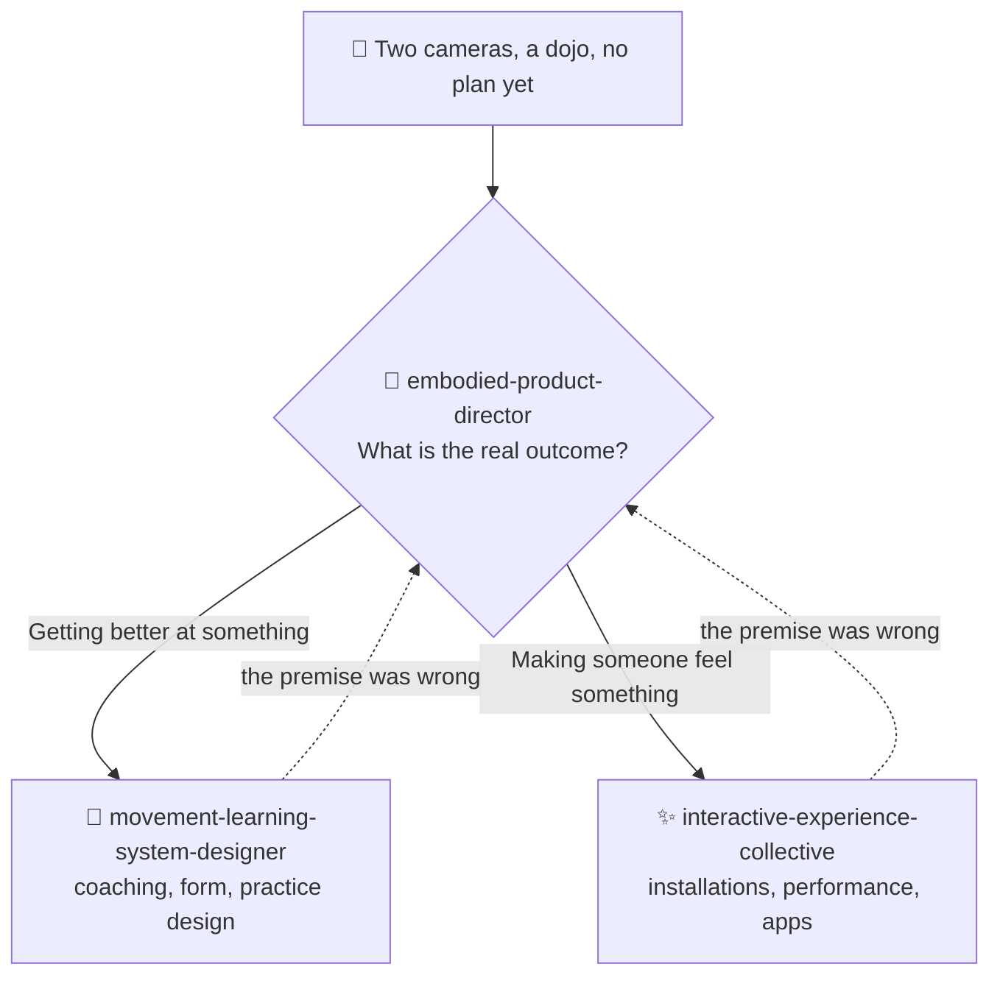

# ⚡ interactive-experience-skills

[](https://opensource.org/licenses/MIT)
[](https://claude.com/claude-code)


**English** · [日本語](README.ja.md) · [简体中文](README.zh-CN.md) · [Español](README.es.md) · [한국어](README.ko.md)

> **Decide whether you are making an artwork or a product — before you pick a single camera, sensor, or framework.**

> **Note:** The three skills are written in Japanese. Claude reads and applies them in any language, but if you open the files yourself you will be reading Japanese. This README set exists so you can decide whether the skills are for you before installing.

---

## 🔰 What is this?

*For non-engineers:* imagine you own two cameras and a hunch that something interesting could be built with them. Most advice jumps straight to which software to use. A good director does the opposite — first they ask who this is for, what actually gets better, and who pays. Only then do they talk about equipment.

These are three Claude Code skills that make Claude behave like that director for projects involving bodies, movement, cameras, and space.

---

## 📐 Architecture



A request that already knows its domain and its deliverable skips the director entirely and fires the specialist directly. The director is an entrance for undecided projects, not a tollgate.

---

## ✨ Features

### 🧭 It routes on outcome, not on keywords
"Dance" could mean choreography learning, media art, a creator tool, fitness, or rehab. The routing question is only ever *is the outcome getting better, or feeling something?* — and the skill commits to one answer with a reason instead of hedging.

### 📐 It answers with numbers you can act on
5,000–8,000 lumens for a 3 m projection in a dark room. A 100 ms latency budget for embodied feedback. Which camera angle can and cannot see a stepping distance. Break-even math for a paid experience. Roughly 96,000 characters of reference material, loaded only when the mode needs it.

### 🚫 It knows where to stop
It will not judge pain, injury, or range of motion. It stays silent rather than guessing when confidence is low, because one obvious misjudgement makes an expert discard the whole system. It puts guardian consent before technology when minors are filmed. And it never mistakes tracking accuracy for learning outcomes.

---

## 🔄 Before / After

| | Before | After |
|---|---|---|
| Starting point | "We have two cameras — what can we build?" | "Which problem makes a second camera worth its cost?" |
| Artwork or product | Argued about indefinitely | Settled by one question, with the reason stated |
| Technical answer | "Immersive, AI-powered, futuristic" | 5,000–8,000 lm · 100 ms · one camera is enough |
| A solo budget | Treated as a downgraded version | Treated as possibly the final and best form |
| Pose estimation | "Better accuracy means better learning" | Accuracy and learning are unrelated; design for learning |

---

## 🚀 Install & Usage

Requires [Claude Code](https://claude.com/claude-code), `git`, `bash`, and `zip`. The installer is a bash script, so use macOS, Linux, or WSL.

### 🖥️ Claude Code (CLI)

```bash
git clone https://github.com/takaoumehara/interactive-experience-skills.git
cd interactive-experience-skills
./install.sh
```

You should see four confirmation lines (the installer prints in Japanese) — one per skill, plus the `/motion-idea` command. The installer verifies that every reference file a skill declares actually exists, and aborts without copying anything if one is missing.

It writes to:

```
~/.claude/skills/embodied-product-director/
~/.claude/skills/interactive-experience-collective/
~/.claude/skills/movement-learning-system-designer/
~/.claude/commands/motion-idea.md
```

Start a new Claude Code session, then either use the command:

```
/motion-idea I have two cameras and want to build something around martial arts practice
```

…or just describe your project in plain language — the specialist skills trigger on their own:

```
Design a projection mapping piece that reacts to a dancer
```

### 🌐 claude.ai (browser)

The repository ships each skill as a packaged archive. They are ordinary zip files:

```bash
cp embodied-product-director.skill embodied-product-director.zip
```

Upload the `.zip` in your assistant's skill settings — see the [Claude Docs](https://docs.claude.com/en/docs/agents-and-tools/agent-skills/overview) for the current upload flow.

### 🛠️ From source

The editable source of truth is `_extracted/`, not the `.skill` archives:

```
_extracted/<skill>/SKILL.md
_extracted/<skill>/references/*.md
_extracted/<skill>/evals/evals.json
```

`SKILL.md` is loaded on every activation; `references/*.md` only when the mode calls for it; `evals/evals.json` holds the trigger tests.

After editing, run `./install.sh` again — it re-deploys to `~/.claude/` and rebuilds the `.skill` archives idempotently.

To install by hand instead, copy the three directories under `_extracted/` into `~/.claude/skills/`.

---

## 📄 License

MIT — see [LICENSE](LICENSE).

Consulting on this domain (designing embodied, movement, camera and spatial experiences; technology selection; validating the business case) is available. Open an issue to get in touch.
