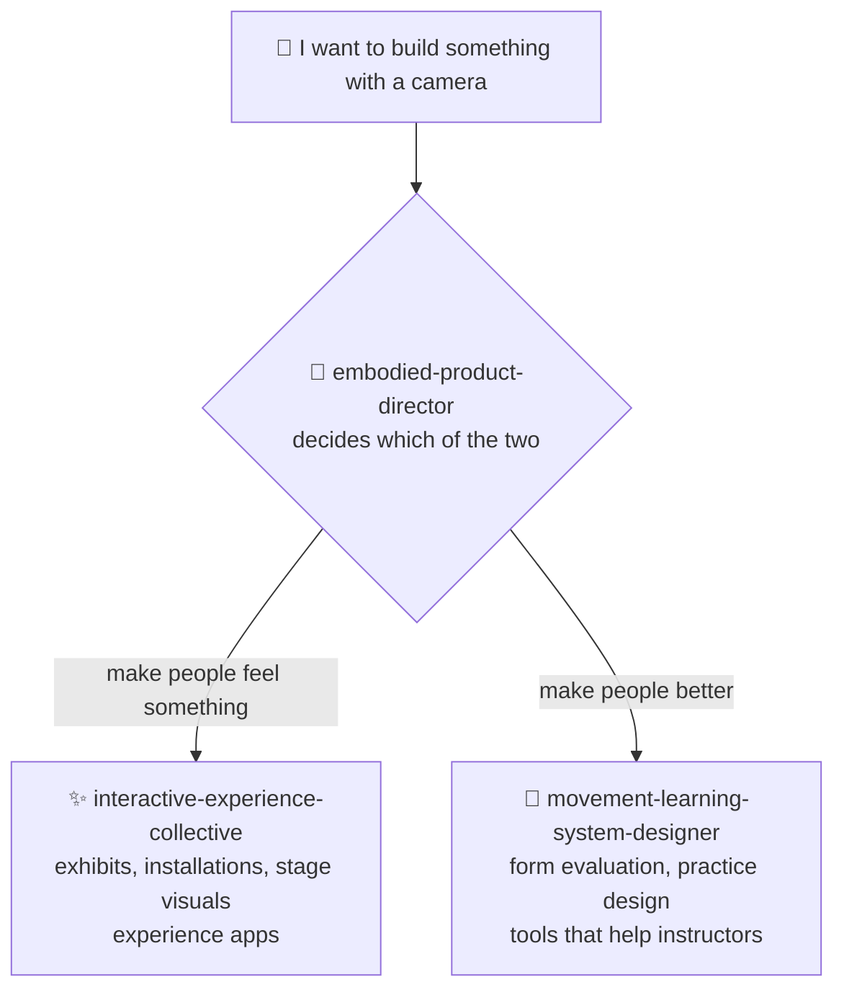

# ⚡ interactive-experience-skills

[](https://opensource.org/licenses/MIT)
[](https://claude.com/claude-code)

-DE3F24)

**English** · [日本語](README.ja.md) · [简体中文](README.zh-CN.md) · [Español](README.es.md) · [한국어](README.ko.md)

> **Build something people experience, or a tool that makes people better at a movement — using cameras and sensors. These Claude Code skills help you design it, starting from deciding which one you are making.**

> **Note on language:** Skill instructions (`SKILL.md`) are in English; the reference library (`references/*.md`) is still in Japanese (translation in progress). Claude reads and applies both in any language, so you can work entirely in English. Each skill's description keeps its Japanese trigger phrases, so Japanese prompts trigger it too. The original Japanese `SKILL.md` files are kept in [`i18n/ja/skills/`](i18n/ja/skills/).

---

## 🔰 What is this?

Use these skills when you want to build something that reads human movement with a camera or a sensor. What you can build falls into two kinds.

**① Something people experience**
The kind of exhibit you see in a museum or at an event, where video and sound react to how people move. Projection mapping, installations, stage visuals, experience-driven apps. **The goal is to make a visitor feel something.**

**② A tool that makes people better**
For things where form matters — dance, martial arts, sports, yoga — a tool that films you, evaluates what you did, tells you what to fix, and designs your practice. **The goal is that the person actually improves.**

These two need different technology, different users, different people paying, and different definitions of success. Yet the most common failure in this field is to start arguing about TouchDesigner versus Unreal, or about pose-estimation accuracy, *before* deciding which of the two you are making. **These skills start by deciding that.**

### What you actually get

Here is what an exchange looks like.

> **You:** "I have two spare webcams. I want to build something around martial arts practice, but I have no direction."
>
> **The skill:** First it decides whether this is an artwork or a training tool. If it is a training tool → who uses it (the student or the teacher?), who pays (the student or the dojo owner?), and what is actually going wrong today (the teacher can't watch everyone? students forget the correction between classes?). Then it commits: "You don't need the second camera yet. Start with one camera, one technique, reviewed after practice rather than live" — with the reasoning.

**It does not write code.** What comes back is a design decision: what to build, roughly what equipment and how much of it, what to validate first, and what *not* to build yet. Implementation is a normal Claude Code job afterwards.

---

## 📐 Architecture


```mermaid
flowchart TD
    Q["👤 I want to build something with a camera"] --> D{"🧭 embodied-product-director<br/>decides which of the two"}
    D -->|"make people feel something"| E["✨ interactive-experience-collective<br/>exhibits, installations, stage visuals<br/>experience apps"]
    D -->|"make people better"| L["🥋 movement-learning-system-designer<br/>form evaluation, practice design<br/>tools that help instructors"]
```

The two skills at the bottom do the actual design work. The director on top only decides which way you go.

**If you already know what you are building, the director never appears.** Write "design an MVP for a form-comparison app for a dojo" and the 🥋 skill starts directly. The director is only for when you have not decided yet.

---

## ✨ Features

### 🧭 It always commits to one of the two
"I want to make a dance app" can mean a tool for memorising choreography or a piece people watch for pleasure — and those are different products. This skill will not end on "well, it could be either." It picks one and tells you why. Not picking is what costs the most.

### 📐 It answers with numbers, not with "immersive" and "AI-powered"
5,000–8,000 lumens to project 3 m wide in a dark room. Feedback on a body movement has to come back within 100 ms or it stops feeling like *your* movement. A front-facing camera cannot measure how deep a step is, so you need a side view. For a paid venue, price × turnover × operating days decides whether it works at all. About 107,000 characters of this across 18 reference files (measured with `wc -m` on `skills/*/references/*.md`, 2026-10-04), loaded only when the current question needs it.

### 🚫 It says no clearly
It does not judge pain or injury — that is medicine. When it is not confident, it says "I can't judge this one" instead of producing something plausible, because a single obviously wrong correction makes an experienced person abandon the system forever. On projects involving children, it raises guardian consent before it discusses technology. And it flatly rejects the belief that **better pose-estimation accuracy makes people learn better.**

---

## 🔄 Before / After

| | Before | After |
|---|---|---|
| How the conversation starts | "We have two cameras — what can we build?" | "Which problem makes a second camera worth its price?" |
| Artwork or tool | Never settled; implementation starts anyway | Settled first, with the reason |
| The technical answer | "An immersive AI-powered experience" | 5,000–8,000 lm · 100 ms · one camera is enough |
| Building alone | Treated as a degraded version of the real thing | Treated as possibly the final and best form |
| Pose estimation | "More accuracy means people learn more" | Accuracy and learning are unrelated; redesign for learning |

---

## 🚀 Install & Usage

### 🖥️ Claude Code (recommended: plugin marketplace)

In Claude Code, run:

```
/plugin marketplace add takaoumehara/interactive-experience-skills
/plugin install interactive-experience-skills@interactive-experience
```

This installs the three skills as one plugin:

```
embodied-product-director
interactive-experience-collective
movement-learning-system-designer
```

Open a new session. Write what you are building normally — the right skill starts on its own.

```
Design a projection mapping piece that reacts to a dancer
```

```
Design the MVP for an app that compares a karate punch against the instructor's
```

If you have no direction yet, say so — the director picks it up:

```
I have two spare webcams and want to build something around martial arts practice
```

The plugin contains only the skills. The maintainer commands (`/motion-idea`, `/refresh-skills`, `/scout-skills`, `/skills-routine`) are installed only by `install.sh` below.

### 🛠️ Alternative: install script (skills + maintainer commands)

Requires `git`, `bash`, and `zip` (macOS, Linux, or WSL).

```bash
git clone https://github.com/takaoumehara/interactive-experience-skills.git
cd interactive-experience-skills
./install.sh
```

You should see seven confirmation lines (the installer prints in Japanese) — three skills and four commands. Before copying anything, the installer checks that every file a skill declares it will read actually exists, and aborts if one is missing. If a skill or command with the same name already exists, it is moved to `~/.claude/backups/interactive-experience-skills-<timestamp>/` instead of being deleted.

It installs to:

```
~/.claude/skills/embodied-product-director/
~/.claude/skills/interactive-experience-collective/
~/.claude/skills/movement-learning-system-designer/
~/.claude/commands/motion-idea.md
~/.claude/commands/refresh-skills.md
~/.claude/commands/scout-skills.md
~/.claude/commands/skills-routine.md
```

Don't install both the plugin and the script copies at the same time, or each skill will be loaded twice.

With the script install, `/motion-idea` is available when you have no direction yet:

```
/motion-idea I have two spare webcams and want to build something around martial arts practice
```

### 🌐 claude.ai (browser)

Run `./package.sh` to build one zip per skill in `dist/` (`dist/<skill>.zip`), then upload it in your assistant's skill settings — see the [Claude Docs](https://docs.claude.com/en/docs/agents-and-tools/agent-skills/overview) for the current flow.

The `.skill` files at the repository root are the same kind of zip (rebuilt by `install.sh`); renaming one to `.zip` also works, but they may lag behind `skills/` until `install.sh` is run again.

> Opening a `.skill` file on GitHub shows nothing. It is not broken — GitHub simply does not recognise the extension and cannot preview it. Download it and run `unzip -l` to see the contents.

### 📁 From source

The editable source of truth is `skills/`, not the `.skill` archives.

```
skills/<skill>/SKILL.md            # English
skills/<skill>/references/*.md     # Japanese (translation in progress)
skills/<skill>/evals/evals.json
i18n/ja/skills/<skill>/SKILL.md    # original Japanese SKILL.md (not loaded as a skill)
.claude-plugin/plugin.json         # plugin manifest
.claude-plugin/marketplace.json    # marketplace manifest
```

`SKILL.md` is loaded on every activation; `references/*.md` only when the current mode needs it; `evals/evals.json` tests that the skill starts when it should.

After editing, run `claude plugin validate --strict .` and `./install.sh` — the script re-deploys to `~/.claude/` and rebuilds the `.skill` archives idempotently. CI runs the same validation on every push and pull request.

To install by hand, copy the three directories under `skills/` into `~/.claude/skills/`.

---

## 🔁 Keeping the skills current

These skills contain product names, price ranges, library names, and hardware numbers. **Those will go stale.** There are two layers of defence.

### ① Verified at the moment of use (automatic, nothing to configure)

Reference passages that can rot carry this marker:

```markdown
<!-- volatile: 2026-07 -->
```

When the skill reads a marked passage, it **searches the web to confirm the current state before answering.** You do not have to do anything.

### ② Refreshed in a batch (manual, roughly monthly)

```
/refresh-skills
```

This collects every marked claim, checks it on the web, and lists **only what changed**. It does not edit anything. You review and decide.

```
/refresh-skills apply
```

This applies what was confirmed, bumps the marker dates, and runs `install.sh`. Only findings with a citation are applied.

To run it on a schedule, use Claude Code's loop:

```
/loop 30d /refresh-skills
```

### ③ Scouting for new options (roughly quarterly)

```
/scout-skills
```

`/refresh-skills` checks whether **what is already written is still true**. It deliberately never adds anything new. So a genuinely new technique can never arrive through it.

`/scout-skills` is the second track. It searches four areas — rendering, audio, capture, distribution — and **never edits a reference file**. It appends candidates to `CANDIDATES.md`. You decide what gets promoted.

A candidate has to pass all four:

1. Does it enable an expression or judgement the existing options cannot produce?
2. Is it reachable at solo or small scale?
3. **Can you write down how it fails?**
4. **Can you name which existing passage it connects to or replaces?**

Most candidates die on #4, and that is the point. When references bloat, the skill starts skimming, and **making it thicker makes it worse.** The value of this command is what it refuses, not what it adds.

Do not run it monthly. Nothing meaningful changes in a month here, and a habit of skipping "no candidates" reports is how you miss the one that mattered.

### ④ One maintenance pass, in order

```
/skills-routine
```

Runs ② verification and ③ scouting as a single pass, **in that order**. The order matters: until you have confirmed that what is written is still true, anything new gets stacked on top of stale claims.

The result comes back as one merged table, not two separate reports. Nothing is applied without asking, and a line goes into the run log.

```
/skills-routine 音響     # scout audio only
/skills-routine verify   # stop after verification
```

**The procedure, the triggers, and the run log live in [`ROUTINE.md`](ROUTINE.md).**

It is deliberately not on a scheduler. A cron dies when the machine changes, and a recurring notification stops being read after the third one. What `ROUTINE.md` has instead is **a list of triggers**.

| Trigger | Run |
|---|---|
| An Apple platform announcement | `/scout-skills 描画` `/scout-skills 配布` |
| Browser GPU / media support moved | `/scout-skills 描画` `/scout-skills 音響` |
| **The skill answered with a stale assumption** | `/refresh-skills` |
| **On a real project you thought "that isn't in the reference"** | Write it into `CANDIDATES.md` by hand, right then |

**The last two are worth the most.** A gap you feel while actually using it is one a web search will never find. The date is not the real signal — these are.

---

## 🧭 Where these skills stand

- **Tracking accuracy and learning are different things.** Accurate pose estimation guarantees nothing about improvement
- **"Correct" is somebody's opinion.** A reference form is not neutral truth; it freezes one instructor's view as authority. Cite the source and let instructors override it
- **Silence when unsure is a feature, not a defect**
- **No judging pain, injury, or range of motion.** No stepping into rehabilitation without a clinician involved
- **When minors are filmed, guardian consent and a retention policy come before the technology**
- **A tight budget should cut unnecessary production complexity, never creative ambition**

---

## 🛠️ Development

`SKILL.md` holds the judgement criteria; only mode-specific *procedures* move into `references/`. Pushing judgement criteria into references produces the failure these skills exist to prevent — answering with generalities without reading anything.

They are deliberately not split into more sub-skills. The more descriptions sit permanently in the system prompt, the worse the hardest call in this domain gets — experience or improvement. An earlier routing check of the three-skill layout was reported as 97% accurate with 11% of cases ambiguous, but the method, model, date, and raw results were never committed, so treat that figure as **to be re-measured**.

`skills/<skill>/evals/evals.json` holds queries that should start each skill and queries that should not. Most of the "should not" cases are not irrelevant queries — they are **near-misses that belong to the sibling skill.** Re-check with this set after editing any description.

---

## 📄 License

MIT — see [LICENSE](LICENSE).

Consulting in this domain (designing embodied, movement, camera and spatial experiences; technology selection; validating the business case) is available. Open an issue to get in touch.
