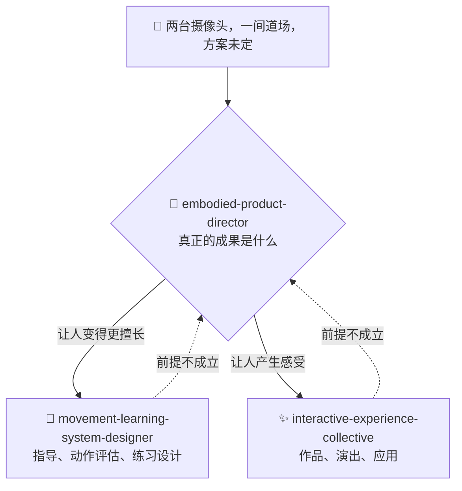

# ⚡ interactive-experience-skills

[](https://opensource.org/licenses/MIT)
[](https://claude.com/claude-code)


[English](README.md) · [日本語](README.ja.md) · **简体中文** · [Español](README.es.md) · [한국어](README.ko.md)

> **在挑选任何摄像头、传感器或框架之前，先确定你做的是作品还是产品。**

> **说明:** 三个 skill 的正文用日语写成。Claude 能用任何语言读取并执行它们，但如果你自己打开文件，看到的会是日语。这套 README 的作用，是让你在安装之前就能判断它是否适合你。

---

## 🔰 这是什么？

*写给非技术读者:* 假设你手上有两台摄像头，隐约觉得能做出点有意思的东西。通常的建议会直接跳到「用哪个软件」。好的导演反过来做——先问这是给谁用的、到底什么变好了、谁来付钱，之后才谈设备。

这是三个 Claude Code skill，让 Claude 在涉及身体、动作、摄像头与空间的项目里，扮演这样的导演。

---

## 📐 系统架构



如果需求本身已经明确了领域和交付物，就会跳过 director，直接触发对应的专业 skill。director 是给方向未定的项目用的入口，不是必经的关卡。

---

## ✨ 三大亮点

### 🧭 按成果分流，而不是按关键词
「舞蹈」可能是编舞学习、媒体艺术、创作工具、健身，也可能是康复。判断只用一个问题：**成果是「变得更擅长」还是「产生感受」**。而且不会停在「两者都算」，一定选一个并说明理由。

### 📐 给出能直接用的数字
暗室里 3 m 宽的投影需要 5,000〜8,000 lm。身体反馈的延迟预算是 100 ms。正面机位测不出步伐的进退距离，必须加侧面。付费体验的盈亏平衡怎么算。参考资料约 96,000 字，只在当前模式需要时才加载。

### 🚫 知道哪里必须停下
不判断疼痛、损伤和关节活动范围。置信度不足时宁可沉默，也不猜测——因为一次明显的误判，就足以让内行放弃整套系统。拍摄未成年人时，监护人同意排在技术之前。而且绝不把追踪精度当成学习效果。

---

## 🔄 使用前 / 使用后

| | 使用前 | 使用后 |
|---|---|---|
| 出发点 | 「有两台摄像头，能做什么？」 | 「在哪个问题上，第二台摄像头才值这个成本」 |
| 作品还是产品 | 一直争论不出结果 | 一个问题定下来，并说明理由 |
| 技术上的回答 | 「沉浸式」「AI 驱动」「未来感」 | 5,000〜8,000 lm · 100 ms · 一台摄像头就够 |
| 个人开发的预算 | 当成打了折扣的版本 | 当成可能是最终且最优的形态 |
| 姿态估计 | 「精度上去了，人就学得更好」 | 精度和学习效果无关，要为学习效果做设计 |

---

## 🚀 安装与使用

需要 [Claude Code](https://claude.com/claude-code)、`git`、`bash` 和 `zip`。安装脚本是 bash 写的，请在 macOS、Linux 或 WSL 上运行。

### 🖥️ Claude Code（CLI）

```bash
git clone https://github.com/takaoumehara/interactive-experience-skills.git
cd interactive-experience-skills
./install.sh
```

看到四行 `配置:` 就说明成功了——三个 skill 加上 `/motion-idea` 命令。安装脚本会先检查每个 skill 声明的参考文件是否真实存在，只要缺一个就中止，不复制任何内容。

安装位置如下:

```
~/.claude/skills/embodied-product-director/
~/.claude/skills/interactive-experience-collective/
~/.claude/skills/movement-learning-system-designer/
~/.claude/commands/motion-idea.md
```

开一个新的 Claude Code 会话，用命令调用:

```
/motion-idea 我有两台摄像头，想围绕武术练习做点什么
```

或者直接用自然语言描述项目，专业 skill 会自己触发:

```
设计一个会跟着舞者动作变化的投影 mapping 作品
```

### 🌐 claude.ai（浏览器）

仓库里带了打包好的 `.skill` 文件，本质上就是 zip:

```bash
cp embodied-product-director.skill embodied-product-director.zip
```

在 skill 设置里上传这个 `.zip`。具体上传流程请参考 [Claude Docs](https://docs.claude.com/en/docs/agents-and-tools/agent-skills/overview)。

### 🛠️ 从源码

要改的是 `_extracted/`，不是 `.skill` 归档:

```
_extracted/<skill>/SKILL.md
_extracted/<skill>/references/*.md
_extracted/<skill>/evals/evals.json
```

`SKILL.md` 每次激活都会加载，`references/*.md` 只在当前模式需要时才加载，`evals/evals.json` 是触发测试集。

改完后再跑一次 `./install.sh`，它会幂等地重新部署到 `~/.claude/` 并重新打包 `.skill`。

如果想手动安装，把 `_extracted/` 下的三个目录复制到 `~/.claude/skills/` 即可。

---

## 📄 许可证

MIT，详见 [LICENSE](LICENSE)。

作者也承接这个领域的咨询：身体、动作、摄像头与空间体验的设计，技术选型，以及商业可行性验证。欢迎通过 issue 联系。
