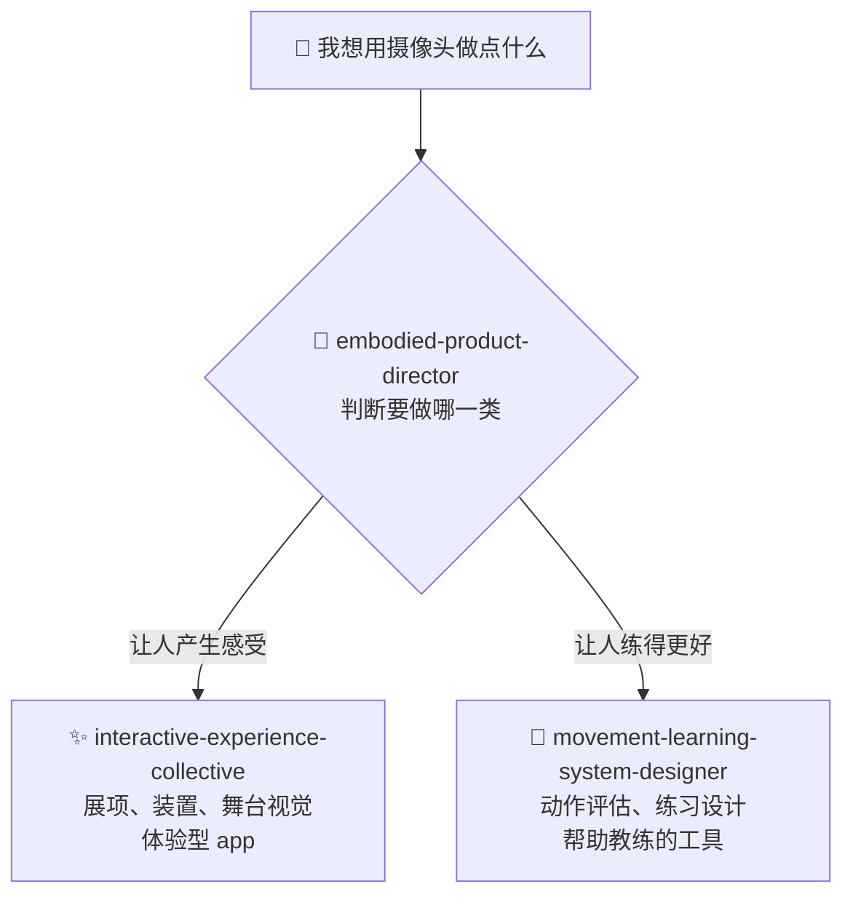

# ⚡ interactive-experience-skills

[](https://opensource.org/licenses/MIT)
[](https://claude.com/claude-code)


[English](README.md) · [日本語](README.ja.md) · **简体中文** · [Español](README.es.md) · [한국어](README.ko.md)

> **用摄像头和传感器，做一件让人体验的作品，或者做一个帮人练好动作的工具。这三个 Claude Code skill 从「你到底要做哪一种」开始，陪你把它设计出来。**

> **说明:** 三个 skill 的正文用日语写成。Claude 能用任何语言读取并执行，所以你可以全程用中文工作。但如果你自己打开文件，看到的会是日语。

---

## 🔰 这是什么？

当你想用摄像头或传感器读取人的动作、并基于此做点什么时，就用这几个 skill。能做的东西大致分两类。

**① 让人体验的东西**
你在美术馆或活动现场见过的那种展项——影像和声音会随着人的动作变化。投影 mapping、装置艺术、舞台视觉、体验型 app。**目标是让来的人产生某种感受。**

**② 帮人练得更好的工具**
针对动作规范很重要的领域——舞蹈、武术、体育、瑜伽——用摄像头拍下来，评估动作，指出该改什么，并安排练习。**目标是使用者真的进步。**

这两类东西，需要的技术不同、用户不同、付钱的人不同、判断成功的标准也不同。可是这个领域里最常见的失败，恰恰是在还没决定做哪一类之前，就开始争论「用 TouchDesigner 还是 Unreal」「姿态估计精度怎么提上去」。**这几个 skill 从决定这件事开始。**

### 具体会得到什么

一次对话大概是这样的。

> **你:**「我手上多出两个摄像头，想围绕武术练习做点什么，但方向还没定。」
>
> **skill:** 先判断这是作品还是训练工具。如果是训练工具 → 谁来用（学员还是教练）、谁来付钱（学员还是道馆经营者）、现在实际卡在哪（教练顾不过来所有人？学员下课就忘了被指出的问题？）。然后给出结论:「第二个摄像头现在不需要。先用一个摄像头，只做一个动作，而且放在练完之后复盘，不要做实时。」并说明理由。

**它不写代码。** 返回的是设计判断: 该做什么、大概需要哪些设备和多少、先验证什么、以及现在先别做什么。实现是之后交给 Claude Code 的普通活儿。

---

## 📐 系统架构



真正做设计的是下面两个。上面的 director 只负责决定往哪边走。

**如果你已经知道要做什么，director 根本不会出现。** 写「帮我设计一个道馆用的动作对比 app 的 MVP」，🥋 那个会直接开始。director 只在你还没定下来的时候才有用。

---

## ✨ 三大亮点

### 🧭 一定会在两类里选一个
「我想做个跳舞的 app」——这可能是帮人记住编舞的工具，也可能是给人看着开心的作品，两者是完全不同的产品。这个 skill 不会以「两个都说得通」收场。它会选一个，并告诉你为什么。不选，才是代价最大的。

### 📐 用数字回答，而不是「沉浸式」「AI 加持」
暗房里投 3 m 宽需要 5,000–8,000 流明。身体动作的反馈必须在 100 ms 内返回，否则就不再像「自己的动作」了。正面机位测不出步子迈得多深，所以需要侧面。做收费场馆的话，客单价 × 翻台率 × 营业天数才决定这门生意成不成立。这类内容约 96,000 字，只在当前问题需要时才加载。

### 🚫 该拒绝的地方直接拒绝
不判断疼痛和损伤——那是医学的事。没有把握的时候，它会说「这次判断不了」，而不是编一个听起来合理的答案，因为一次明显的误判就足以让内行永远弃用这套系统。涉及儿童的项目，它会先谈监护人同意，再谈技术。而且它明确否定一个想法:**姿态估计精度提上去，人就学得更好。**

---

## 🔄 使用前 / 使用后

| | 使用前 | 使用后 |
|---|---|---|
| 对话怎么开头 | 「有两个摄像头，能做什么？」 | 「在哪个问题上，第二个摄像头才对得起这个价钱」 |
| 作品还是工具 | 一直没定，实现却已经开工 | 先定下来，并说明理由 |
| 技术上的答案 | 「做一个 AI 驱动的沉浸式体验」 | 5,000–8,000 lm · 100 ms · 一个摄像头就够 |
| 一个人做 | 当成正式版的缩水版 | 当成可能是最终且最优的形态 |
| 姿态估计 | 「精度上去了，人就学得更好」 | 精度和学习无关，要为学习重新设计 |

---

## 🚀 安装与使用

需要 [Claude Code](https://claude.com/claude-code)、`git`、`bash` 和 `zip`。安装脚本是 bash 写的，请在 macOS、Linux 或 WSL 上运行。

### 🖥️ Claude Code（CLI）

```bash
git clone https://github.com/takaoumehara/interactive-experience-skills.git
cd interactive-experience-skills
./install.sh
```

看到五行确认输出（脚本用日语打印）就说明成功了——三个 skill 加两个命令。在复制任何东西之前，安装脚本会先确认每个 skill 声明要读取的文件是否真实存在，缺一个就中止。

安装位置如下:

```
~/.claude/skills/embodied-product-director/
~/.claude/skills/interactive-experience-collective/
~/.claude/skills/movement-learning-system-designer/
~/.claude/commands/motion-idea.md
~/.claude/commands/refresh-skills.md
```

开一个新会话。如果方向还没定，用命令:

```
/motion-idea 我手上多出两个摄像头，想围绕武术练习做点什么
```

如果已经知道要做什么，直接正常写就行，对应的 skill 会自己启动。

```
设计一个会跟着舞者动作变化的投影 mapping 作品
```

```
设计一个把空手道出拳和教练示范做对比的 app 的 MVP
```

### 🌐 claude.ai（浏览器）

每个 skill 都打包成了 `.skill` 文件，本质就是 zip，改个后缀就能上传。

```bash
cp movement-learning-system-designer.skill movement-learning-system-designer.zip
```

在 skill 设置里上传这个 `.zip`。具体流程请参考 [Claude Docs](https://docs.claude.com/en/docs/agents-and-tools/agent-skills/overview)。

> 在 GitHub 上点开 `.skill` 文件会看到一片空白。这不是文件坏了——GitHub 不认识这个后缀，没法预览而已。下载下来跑 `unzip -l` 就能看到内容。

### 🛠️ 从源码

要改的是 `_extracted/`，不是 `.skill` 归档。

```
_extracted/<skill>/SKILL.md
_extracted/<skill>/references/*.md
_extracted/<skill>/evals/evals.json
```

`SKILL.md` 每次激活都会加载，`references/*.md` 只在当前模式需要时才加载，`evals/evals.json` 用来测试 skill 该启动的时候会不会启动。

改完后再跑一次 `./install.sh`，它会幂等地重新部署到 `~/.claude/` 并重新打包 `.skill`。

想手动安装的话，把 `_extracted/` 下的三个目录复制到 `~/.claude/skills/` 即可。

---

## 🔁 让 skill 保持最新

这些 skill 里写了产品名、价格区间、库的名字和硬件参数。**这些一定会过时。** 对策有两层。

### ① 用的时候现场确认（自动，不需要配置）

会过时的参考内容都带着这个标记:

```markdown
<!-- volatile: 2026-07 -->
```

skill 读到带标记的段落时，会**先上网确认当前情况再回答**。你什么都不用做。

### ② 定期批量更新（手动，大约每月一次）

```
/refresh-skills
```

它会把所有带标记的说法收集起来逐一核查，只列出**确实变了的部分**。它不会改任何文件，由你判断。

```
/refresh-skills apply
```

这条会把核实过的内容写回文件、更新标记里的年月，并运行 `install.sh`。只有能给出出处的结论才会被写入。

想让它定期自动跑，可以用 Claude Code 的循环:

```
/loop 30d /refresh-skills
```

---

## 🧭 这几个 skill 的立场

- **追踪精度和学习效果是两回事。** 姿态估计再准，也不保证人会进步
- **「正确」是某个人的意见。** 参考动作不是中立的真理，它把某一位教练的看法固定成了权威。要标明出处，并让教练能够覆盖它
- **没把握时保持沉默是功能，不是缺陷**
- **不判断疼痛、损伤和关节活动范围。** 没有临床专业人员参与，就不踏进康复领域
- **拍摄未成年人时，监护人同意和数据留存政策排在技术之前**
- **预算紧该砍掉的是不必要的制作复杂度，绝不是创作野心**

---

## 🛠️ 开发

`SKILL.md` 里放判断标准，只有**特定模式才用得到的操作步骤**才移进 `references/`。把判断标准推到参考文件里，恰恰会造成这几个 skill 要防止的失败——什么都不读就给一堆泛泛之谈。

它们刻意没有被拆成更多子 skill。常驻在 system prompt 里的说明越多，这个领域里最难的那个判断——体验还是进步——就越容易出错。三个 skill 这套结构的实测分流准确率是 97%，其中 11% 属于难以判定。

`_extracted/<skill>/evals/evals.json` 里放着「应该启动」和「不应该启动」的查询。「不应该启动」的大部分并不是无关的查询，而是**本该归另一个 skill 的相近案例**。改过任何说明文字之后，用这套重新验证一遍。

---

## 🔄 保持时效

交互体验领域的事实层变化很快：传感器停产、GPU 价格翻倍、系统更新悄悄破坏了身体追踪 API、法规的生效日期改变。**用去年的价格自信作答的技能，比不作答的技能更有害。**

四个机制各司其职：参考文件开头的 `<!-- volatile: YYYY-MM -->` 是**索引**（指明该文件哪类记述会过时）；`references/current.md` 是**答案存放处**（当前情况，附日期、出处与置信度）；`/refresh-skills` 是**随时核对**（只报告变化）；`maintenance/UPDATE-ROUTINE.md` 是**月度流程**（核对、记录、留存历史、提交 PR）。

回答时的顺序：使用带标记的记述 → 先看 `current.md` → 若没有或已超过六个月则联网检索 → 否则注明时点。`CHANGELOG.md` 记录改了什么、**刻意不改什么**，以及**根本没调查什么**。

---

## 📄 许可证

MIT，详见 [LICENSE](LICENSE)。

作者也承接这个领域的咨询：身体、动作、摄像头与空间体验的设计，技术选型，以及商业可行性验证。欢迎通过 issue 联系。
