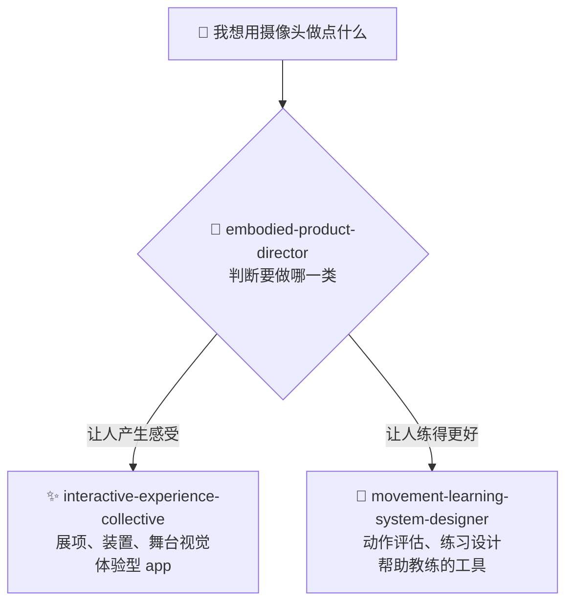

# ⚡ interactive-experience-skills

[](https://opensource.org/licenses/MIT)
[](https://claude.com/claude-code)

-DE3F24)

[English](README.md) · [日本語](README.ja.md) · **简体中文** · [Español](README.es.md) · [한국어](README.ko.md)

> **用摄像头和传感器，做一件让人体验的作品，或者做一个帮人练好动作的工具。这三个 Claude Code skill 从「你到底要做哪一种」开始，陪你把它设计出来。**

> **关于语言:** skill 的指令（`SKILL.md`）是英文，参考资料（`references/*.md`）仍是日文（翻译进行中）。Claude 能用任何语言读取并执行它们，所以你可以全程用中文工作。每个 skill 的 description 保留了日语触发词，所以用日语提问也能启动。日文版 `SKILL.md` 原文保存在 [`i18n/ja/skills/`](i18n/ja/skills/)。

---

## 🔰 这是什么？

当你想用摄像头或传感器读取人的动作、并基于此做点什么时，就用这几个 skill。能做的东西大致分两类。

**① 让人体验的东西**
你在美术馆或活动现场见过的那种展项——影像和声音会随着人的动作变化。投影 mapping、装置艺术、舞台视觉、体验型 app。**目标是让来的人产生某种感受。**

**② 帮人练得更好的工具**
针对动作规范很重要的领域——舞蹈、武术、体育、瑜伽——用摄像头拍下来，评估动作，指出该改什么，并安排练习。**目标是使用者真的进步。**

这两类东西，需要的技术不同、用户不同、付钱的人不同、判断成功的标准也不同。可是这个领域里最常见的失败，恰恰是在还没决定做哪一类之前，就开始争论「用 TouchDesigner 还是 Unreal」「姿态估计精度怎么提上去」。**这几个 skill 从决定这件事开始。**

### 具体会得到什么

一次对话大概是这样的。

> **你:**「我手上多出两个摄像头，想围绕武术练习做点什么，但方向还没定。」
>
> **skill:** 先判断这是作品还是训练工具。如果是训练工具 → 谁来用（学员还是教练）、谁来付钱（学员还是道馆经营者）、现在实际卡在哪（教练顾不过来所有人？学员下课就忘了被指出的问题？）。然后给出结论:「第二个摄像头现在不需要。先用一个摄像头，只做一个动作，而且放在练完之后复盘，不要做实时。」并说明理由。

**它不写代码。** 返回的是设计判断: 该做什么、大概需要哪些设备和多少、先验证什么、以及现在先别做什么。实现是之后交给 Claude Code 的普通活儿。

---

## 📐 系统架构


```mermaid
flowchart TD
    Q["👤 我想用摄像头做点什么"] --> D{"🧭 embodied-product-director<br/>判断要做哪一类"}
    D -->|"让人产生感受"| E["✨ interactive-experience-collective<br/>展项、装置、舞台视觉<br/>体验型 app"]
    D -->|"让人练得更好"| L["🥋 movement-learning-system-designer<br/>动作评估、练习设计<br/>帮助教练的工具"]
```

真正做设计的是下面两个。上面的 director 只负责决定往哪边走。

**如果你已经知道要做什么，director 根本不会出现。** 写「帮我设计一个道馆用的动作对比 app 的 MVP」，🥋 那个会直接开始。director 只在你还没定下来的时候才有用。

---

## ✨ 三大亮点

### 🧭 一定会在两类里选一个
「我想做个跳舞的 app」——这可能是帮人记住编舞的工具，也可能是给人看着开心的作品，两者是完全不同的产品。这个 skill 不会以「两个都说得通」收场。它会选一个，并告诉你为什么。不选，才是代价最大的。

### 📐 用数字回答，而不是「沉浸式」「AI 加持」
暗房里投 3 m 宽需要 5,000–8,000 流明。身体动作的反馈必须在 100 ms 内返回，否则就不再像「自己的动作」了。正面机位测不出步子迈得多深，所以需要侧面。做收费场馆的话，客单价 × 翻台率 × 营业天数才决定这门生意成不成立。这类内容分布在 18 个参考文件里，约 107,000 字（对 `skills/*/references/*.md` 用 `wc -m` 统计，2026-10-04），只在当前问题需要时才加载。

### 🚫 该拒绝的地方直接拒绝
不判断疼痛和损伤——那是医学的事。没有把握的时候，它会说「这次判断不了」，而不是编一个听起来合理的答案，因为一次明显的误判就足以让内行永远弃用这套系统。涉及儿童的项目，它会先谈监护人同意，再谈技术。而且它明确否定一个想法:**姿态估计精度提上去，人就学得更好。**

---

## 🔄 使用前 / 使用后

| | 使用前 | 使用后 |
|---|---|---|
| 对话怎么开头 | 「有两个摄像头，能做什么？」 | 「在哪个问题上，第二个摄像头才对得起这个价钱」 |
| 作品还是工具 | 一直没定，实现却已经开工 | 先定下来，并说明理由 |
| 技术上的答案 | 「做一个 AI 驱动的沉浸式体验」 | 5,000–8,000 lm · 100 ms · 一个摄像头就够 |
| 一个人做 | 当成正式版的缩水版 | 当成可能是最终且最优的形态 |
| 姿态估计 | 「精度上去了，人就学得更好」 | 精度和学习无关，要为学习重新设计 |

---

## 🚀 安装与使用

### 🖥️ Claude Code（推荐: 插件市场）

在 Claude Code 里运行:

```
/plugin marketplace add takaoumehara/interactive-experience-skills
/plugin install interactive-experience-skills@interactive-experience
```

三个 skill 会作为一个插件安装:

```
embodied-product-director
interactive-experience-collective
movement-learning-system-designer
```

打开新会话，直接正常描述你要做的东西，对应的 skill 会自动启动。

```
设计一个会对舞者动作做出反应的投影映射作品
```

```
设计一个 App 的 MVP: 把空手道冲拳的动作和教练的示范做对比
```

如果方向还没定，直接这样说，director 会接手:

```
我手上多出两个摄像头，想围绕武术练习做点什么
```

插件里只有 skill。维护用的命令（`/motion-idea`、`/refresh-skills`、`/scout-skills`、`/skills-routine`）只能通过下面的 `install.sh` 安装。

### 🛠️ 另一种方式: 安装脚本（skill + 维护命令）

需要 `git`、`bash` 和 `zip`（macOS、Linux 或 WSL）。

```bash
git clone https://github.com/takaoumehara/interactive-experience-skills.git
cd interactive-experience-skills
./install.sh
```

看到 7 行确认信息（安装脚本输出的是日语）——三个 skill 加四个命令——就说明成功了。复制之前，安装脚本会先检查每个 skill 声明要读的文件是否真的存在，只要缺一个就中止。如果已经有同名的 skill 或命令，不会删除，而是移到 `~/.claude/backups/interactive-experience-skills-<时间戳>/`。

安装位置:

```
~/.claude/skills/embodied-product-director/
~/.claude/skills/interactive-experience-collective/
~/.claude/skills/movement-learning-system-designer/
~/.claude/commands/motion-idea.md
~/.claude/commands/refresh-skills.md
~/.claude/commands/scout-skills.md
~/.claude/commands/skills-routine.md
```

不要同时用插件和脚本安装，否则每个 skill 会被加载两次。

用脚本安装时，方向未定还可以用 `/motion-idea`:

```
/motion-idea 我手上多出两个摄像头，想围绕武术练习做点什么
```

### 🌐 claude.ai（浏览器）

运行 `./package.sh`，会在 `dist/` 里为每个 skill 生成一个 zip（`dist/<skill>.zip`），然后在 skill 设置里上传。当前流程请参考 [Claude Docs](https://docs.claude.com/en/docs/agents-and-tools/agent-skills/overview)。

仓库根目录的 `.skill` 文件也是同样的 zip（由 `install.sh` 重新生成），改名为 `.zip` 也能上传，但在重新运行 `install.sh` 之前可能比 `skills/` 旧。

> 在 GitHub 上打开 `.skill` 文件什么也看不到。文件没有坏——只是 GitHub 不认识这个扩展名，无法预览。下载后用 `unzip -l` 就能看到内容。

### 📁 从源码

可编辑的正本是 `skills/`，不是 `.skill` 压缩包。

```
skills/<skill>/SKILL.md            # 英文
skills/<skill>/references/*.md     # 日文（翻译进行中）
skills/<skill>/evals/evals.json
i18n/ja/skills/<skill>/SKILL.md    # 日文版 SKILL.md 原文（不会作为 skill 加载）
.claude-plugin/plugin.json         # 插件清单
.claude-plugin/marketplace.json    # 插件市场清单
```

`SKILL.md` 每次启动都会加载；`references/*.md` 只在当前模式需要时加载；`evals/evals.json` 用来测试 skill 是否在该启动时启动。

修改后运行 `claude plugin validate --strict .` 和 `./install.sh`——脚本会幂等地部署到 `~/.claude/` 并重新打包 `.skill`。CI 在每次 push 和 pull request 时也会跑同样的校验。

想手动安装的话，把 `skills/` 下的三个目录复制到 `~/.claude/skills/` 即可。

---

## 🔁 让 skill 保持最新

这些 skill 里写了产品名、价格区间、库的名字和硬件参数。**这些一定会过时。** 对策有两层。

### ① 用的时候现场确认（自动，不需要配置）

会过时的参考内容都带着这个标记:

```markdown
<!-- volatile: 2026-07 -->
```

skill 读到带标记的段落时，会**先上网确认当前情况再回答**。你什么都不用做。

### ② 定期批量更新（手动，大约每月一次）

```
/refresh-skills
```

它会把所有带标记的说法收集起来逐一核查，只列出**确实变了的部分**。它不会改任何文件，由你判断。

```
/refresh-skills apply
```

这条会把核实过的内容写回文件、更新标记里的年月，并运行 `install.sh`。只有能给出出处的结论才会被写入。

想让它定期自动跑，可以用 Claude Code 的循环:

```
/loop 30d /refresh-skills
```

### ③ 寻找新的手段（大约每季度一次）

```
/scout-skills
```

`/refresh-skills` 检查的是**已经写下来的内容现在是否仍然成立**，它有意不添加任何新东西。所以真正的新手段在结构上不可能从那边进来。

`/scout-skills` 是第二条线。它调查绘制、音响、采集、分发四个领域，**完全不改动任何参考文件**，只把候选追加到 `CANDIDATES.md`。是否采用由你决定。

候选必须同时满足四条:

1. 能否做出现有手段做不出的表达或判断？
2. 个人或小规模能否达到？
3. **能否写出它是怎么坏的？**
4. **能否说清它接到哪一段既有描述上，或替换掉什么？**

绝大多数会倒在第 4 条，这是对的。参考文件一旦变胖，skill 就会开始少读，**加厚反而让质量下降。**这条命令的价值不在于加了多少，而在于挡住了多少。

不要按月跑。这个领域一个月内不会有实质变化，而习惯性略过「无候选」的报告，正是真正变化时会漏掉的原因。

### ④ 一次维护，按顺序跑完

```
/skills-routine
```

把②的核查和③的探索合成一次跑完，**并且按这个顺序**。顺序是有意义的: 在确认已写内容是否仍然成立之前，新东西只会堆在过时的说法之上。

结果是一张合并的表，不是两份报告。不问过就不会写入任何文件，并且会在执行记录里留下一行。

```
/skills-routine 音響     # 只探索音响
/skills-routine verify   # 只做核查就停下
```

**步骤、触发条件和执行记录都在 [`ROUTINE.md`](ROUTINE.md)。**

它有意没有挂到调度器上。cron 换台机器就没了，重复通知到第三次就不会有人看。`ROUTINE.md` 里放的是**触发条件清单**。

| 触发 | 跑什么 |
|---|---|
| Apple 平台发布 | `/scout-skills 描画` `/scout-skills 配布` |
| 浏览器的 GPU / 媒体支持有变动 | `/scout-skills 描画` `/scout-skills 音響` |
| **skill 的回答里混进了过时的前提** | `/refresh-skills` |
| **实际做项目时觉得「这个参考里没有」** | 当场手写进 `CANDIDATES.md` |

**最后两条最有价值。**真正用起来才感觉到的缺口，搜索永远找不到。日期不是真正的信号，这些才是。

---

## 🧭 这几个 skill 的立场

- **追踪精度和学习效果是两回事。** 姿态估计再准，也不保证人会进步
- **「正确」是某个人的意见。** 参考动作不是中立的真理，它把某一位教练的看法固定成了权威。要标明出处，并让教练能够覆盖它
- **没把握时保持沉默是功能，不是缺陷**
- **不判断疼痛、损伤和关节活动范围。** 没有临床专业人员参与，就不踏进康复领域
- **拍摄未成年人时，监护人同意和数据留存政策排在技术之前**
- **预算紧该砍掉的是不必要的制作复杂度，绝不是创作野心**

---

## 🛠️ 开发

`SKILL.md` 里放判断标准，只有**特定模式才用得到的操作步骤**才移进 `references/`。把判断标准推到参考文件里，恰恰会造成这几个 skill 要防止的失败——什么都不读就给一堆泛泛之谈。

它们刻意没有被拆成更多子 skill。常驻在 system prompt 里的说明越多，这个领域里最难的那个判断——体验还是进步——就越容易出错。之前写过三个 skill 这套结构的分流准确率为 97%、难以判定的占 11%，但方法、模型、日期和原始结果都没有提交到仓库，所以这个数字请视为**待重新测量**。

`skills/<skill>/evals/evals.json` 里放着「应该启动」和「不应该启动」的查询。「不应该启动」的大部分并不是无关的查询，而是**本该归另一个 skill 的相近案例**。改过任何说明文字之后，用这套重新验证一遍。

---

## 📄 许可证

MIT，详见 [LICENSE](LICENSE)。

作者也承接这个领域的咨询：身体、动作、摄像头与空间体验的设计，技术选型，以及商业可行性验证。欢迎通过 issue 联系。
